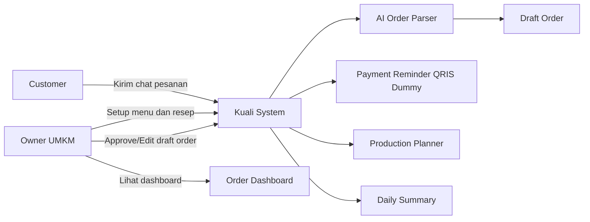
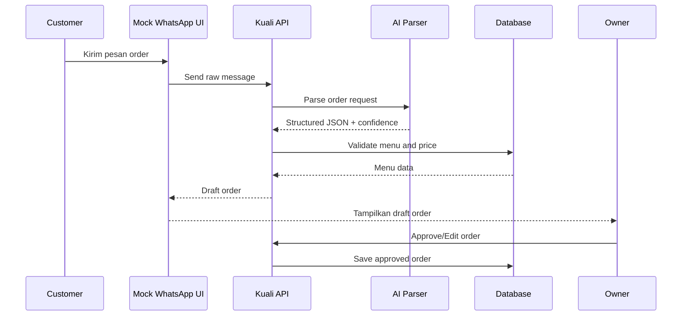
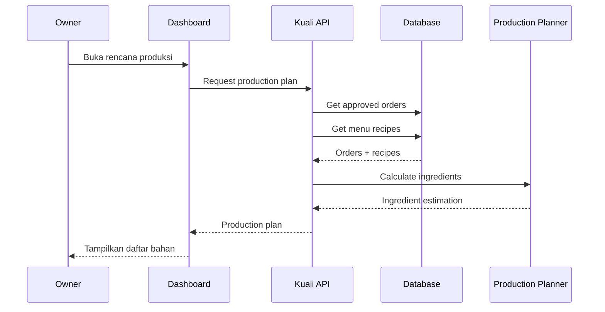
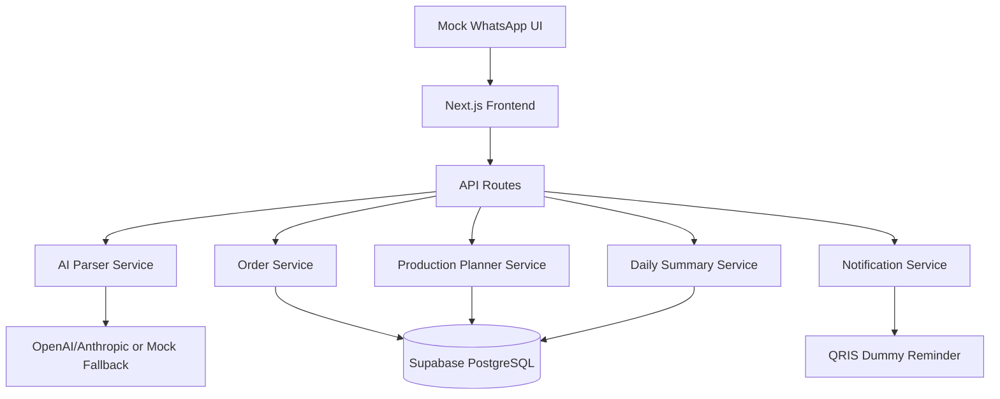
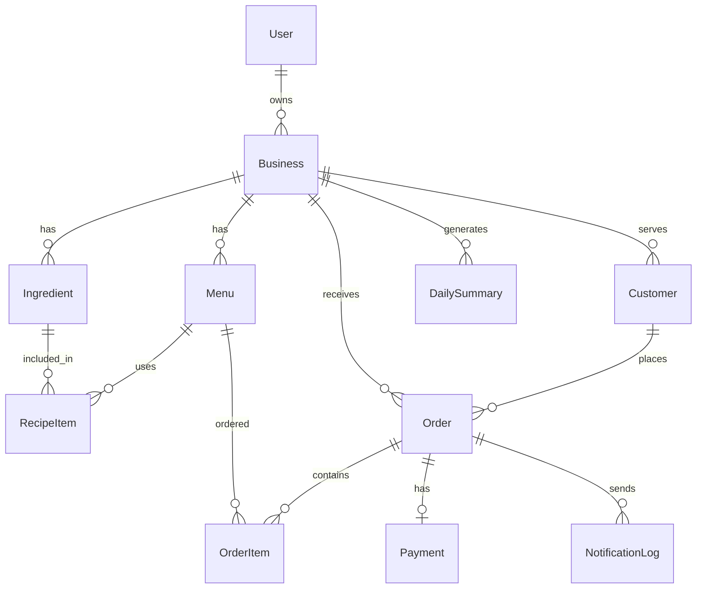

# 04 — Hacker: Technology & Implementation

## Hacker Objective

Role Hacker menjelaskan bagaimana Kuali dapat dibangun secara teknis dengan realistis untuk prototype hackathon. Fokus: baseline architecture, AI design, diagram, database draft, API draft, dan risiko teknis.

## Technical Overview

| Layer | Teknologi |
|---|---|
| Frontend | Next.js App Router, TypeScript, Tailwind CSS, shadcn/ui |
| UI Utility | Framer Motion, Lucide React, Sonner, Recharts |
| Validation | Zod, React Hook Form |
| Database | Supabase PostgreSQL + Prisma ORM |
| AI | OpenAI API atau Anthropic API dengan structured JSON |
| WhatsApp | Mock WhatsApp UI, n8n optional, Meta Cloud API roadmap |
| Payment | QRIS dummy image, payment reminder only |
| Deployment | Vercel, Supabase, Railway optional, GCP roadmap |

## AI Utilization

AI digunakan untuk:

1. AI Order Parser.
2. Missing Field Detector.
3. Suggested Reply.
4. Daily Summary.

AI tidak boleh mengarang menu, mengarang harga, mengonfirmasi pembayaran, menghitung bahan tanpa resep, menyetujui order otomatis, atau mengambil keputusan final.

## AI Structured JSON Schema

```json
{
  "customer_name": "Dinda",
  "phone_number": null,
  "order_items": [
    {
      "menu_name": "Risol Mayo",
      "matched_menu_id": "menu_risol_mayo",
      "quantity": 12,
      "unit_price": 5000,
      "subtotal": 60000
    }
  ],
  "pickup_time": "Besok, 15.00",
  "payment_status": "UNPAID",
  "missing_fields": [],
  "confidence_score": 0.92,
  "suggested_reply": "Baik Kak Dinda, pesanan 12 Risol Mayo untuk besok jam 15.00 sudah kami catat sebagai draft. Total Rp60.000.",
  "needs_owner_review": false,
  "raw_message": "Kak mau pesan 12 risol mayo buat besok jam 3, atas nama Dinda. Bayar nanti sore ya."
}
```

## Example Input Chat

```text
Kak mau pesan 12 risol mayo buat besok jam 3, atas nama Dinda. Bayar nanti sore ya.
```

## Human-in-the-loop Rule

Semua hasil AI bersifat draft. Owner selalu approve/edit sebelum order final.

| Score | Status | Tindakan |
|---:|---|---|
| 0.85–1.00 | High confidence | Draft siap approval |
| 0.60–0.84 | Medium confidence | Perlu cek owner |
| < 0.60 | Low confidence | Minta klarifikasi |

## Backend Validation Rule

Backend memvalidasi menu, harga, quantity, pickup time, payment status, dan ingredient calculation. Harga, menu, dan resep berasal dari database, bukan AI.

## System Architecture

```text
Mock WhatsApp UI
  ↓
Frontend Next.js
  ↓
API Route /api/ai/parse-order
  ↓
AI Provider / Mocked Fallback
  ↓
Validation Layer
  ↓
Draft Order
  ↓
Owner Approval
  ↓
Order Dashboard
  ↓
Payment Reminder + Production Planner + Daily Summary
```

## Use Case Diagram



## Sequence Diagram: Chat Order to Draft Order



## Sequence Diagram: Production Planner



## System Design Diagram



## ERD



## Database Design

Entities MVP:
- User
- Business
- Menu
- Ingredient
- RecipeItem
- Customer
- Order
- OrderItem
- Payment
- NotificationLog
- DailySummary

## API Endpoint Draft

| Method | Endpoint | Purpose |
|---|---|---|
| GET | `/api/health` | Health check |
| GET | `/api/dashboard` | Dashboard metrics |
| GET | `/api/orders` | List orders |
| POST | `/api/orders` | Create draft/manual order |
| GET | `/api/orders/:id` | Order detail |
| PATCH | `/api/orders/:id/status` | Update order status |
| PATCH | `/api/orders/:id/payment` | Update payment status |
| GET | `/api/menus` | List menu |
| POST | `/api/menus` | Add menu |
| GET | `/api/ingredients` | List ingredients |
| POST | `/api/ai/parse-order` | Parse chat |
| POST | `/api/ai/production-plan` | Generate production plan |
| POST | `/api/ai/daily-summary` | Generate daily summary |
| POST | `/api/webhooks/whatsapp` | Future webhook |
| POST | `/api/notifications/payment-reminder` | Payment reminder dummy |

## WhatsApp Integration Plan

| Phase | Approach | Status |
|---|---|---|
| Proposal / Mockup | Mock WhatsApp UI | MVP baseline |
| Prototype Advanced | n8n webhook simulation | Optional |
| Roadmap | Meta WhatsApp Business Cloud API | Deferred |

## Payment Plan

QRIS dummy only. No real settlement. Kuali tidak diklaim sebagai payment gateway.

## Security / Privacy

- Data minimization.
- Dummy data untuk proposal/demo.
- Owner approval required.
- Future broadcast requires opt-in.
- Payment data not processed in MVP.

## Technical Risks and Mitigation

| Risiko | Mitigasi |
|---|---|
| AI salah parsing | Confidence score + owner approval |
| AI hallucinate harga | Harga dari database |
| WhatsApp API gagal | Mock UI first |
| Payment risk | QRIS dummy only |
| Scope creep | MVP boundary docs |
| Demo error | Static fallback and dummy data |

## Hacker Task Checklist

- [ ] AI JSON schema draft
- [ ] Mermaid use case diagram
- [ ] Mermaid sequence diagram
- [ ] Mermaid architecture diagram
- [ ] ERD draft
- [ ] API endpoint draft
- [ ] Database entity draft
- [ ] Risk mitigation

## Acceptance Criteria

- Diagram valid.
- AI boundary jelas.
- MVP tidak butuh real WhatsApp/QRIS.
- Database entity cukup untuk MVP.
- API draft mendukung demo flow.
