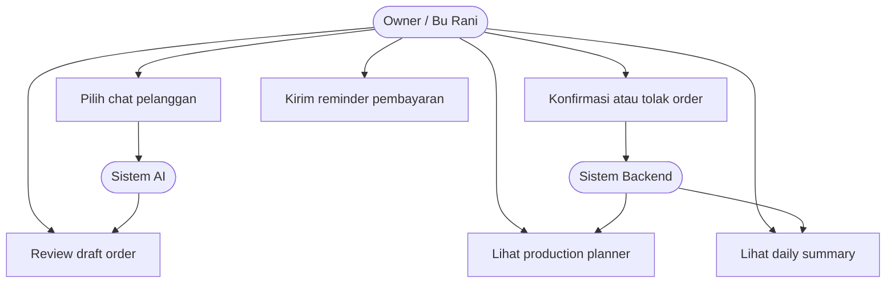
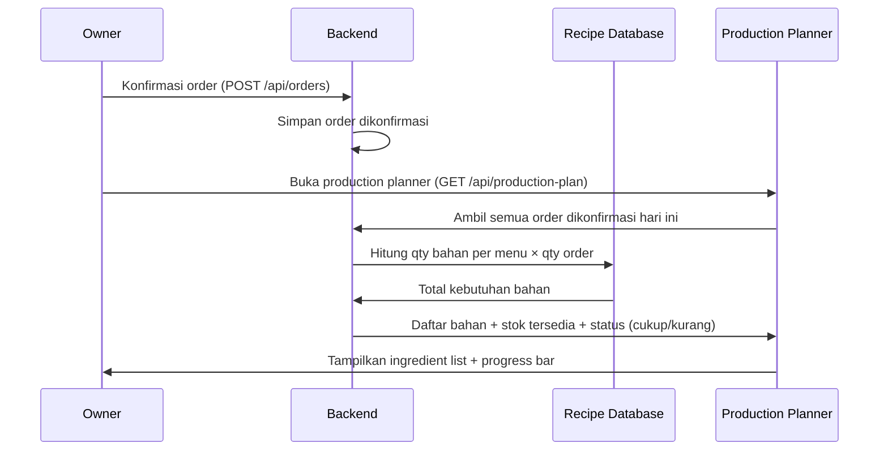
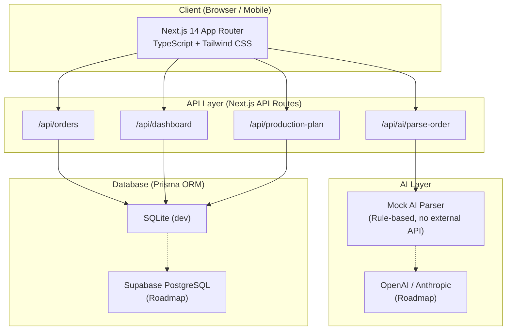
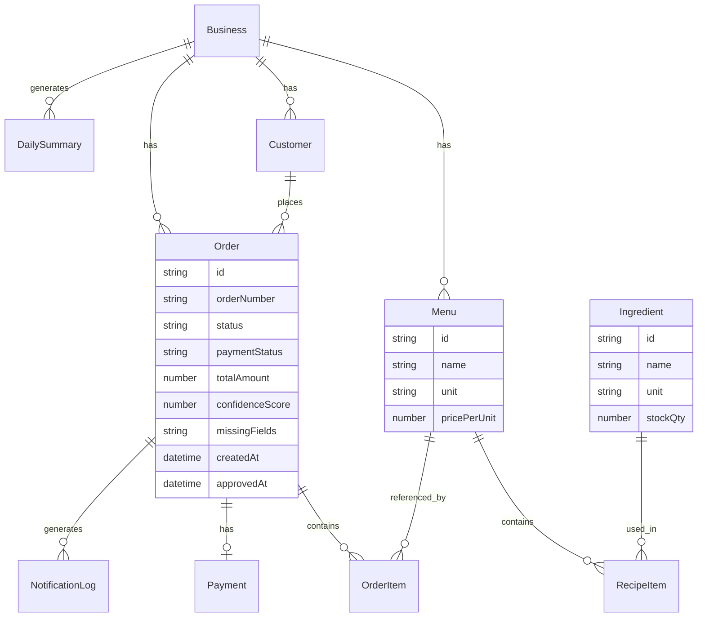

# 10 — Final Proposal Review

> **Reviewer:** Claude Code — Strict Hackathon Proposal Reviewer
> **Tanggal review:** 2026-05-18
> **File yang direview:**
> - `docs/proposal/99_FINAL_PROPOSAL_SUBMISSION.md`
> - `docs/proposal/00_PROPOSAL_MASTER_KUALI.md`
> - `docs/proposal/07_PROPOSAL_TASK_BOARD.md`
> - `docs/proposal/09_PROPOSAL_REFACTOR_REPORT.md`
>
> **Tujuan review:** Apakah draft proposal sudah siap untuk review leader dan formatting PDF?

---

## Skor Kesiapan Keseluruhan

| Dimensi | Skor | Catatan |
|---|---|---|
| Struktur & kelengkapan section | 7/10 | Semua section ada, tapi 4 diagram wajib masih teks |
| Kualitas narasi & bahasa | 9/10 | Formal, jelas, tidak menggunakan framing berbahaya |
| Keamanan scope (MVP vs roadmap) | 9/10 | Pemisahan roadmap konsisten dan eksplisit |
| Keamanan sumber/statistik | 8/10 | [NEED SOURCE] sudah konsisten dipakai |
| Kontribusi per role | 6/10 | Hustler dan Hipster terlihat, Hacker kuat di teks tapi minim diagram |
| Kelengkapan diagram teknis | 4/10 | Hanya 1 dari 5 diagram terealisasi dalam Mermaid |
| **TOTAL RATA-RATA** | **7.2 / 10** | **Belum siap PDF — perlu 5 perbaikan prioritas** |

---

## Review Per Section

### COVER
**Status: NEEDS_REVISION**

| Item | Kondisi | Catatan |
|---|---|---|
| Judul proposal | ✅ Ada | "Kuali — Order Rapi, Produksi Siap" |
| Nama event | ✅ Ada | Gunadarma Code Week 2.0 |
| Subtema | ✅ Ada | Food & Culinary Business Tech |
| Nama tim | ❌ Placeholder | Masih `[NAMA TIM]` |
| Nama anggota | ❌ Placeholder | Masih `[Nama 1]` – `[Nama 5]` |
| Pembagian role | ✅ Ada | Leader/Hacker/Hustler/Hipster dicantumkan |

**Aksi:** Tim wajib mengisi nama sebelum PDF. Ini bukan opsi — proposal tidak boleh disubmit dengan placeholder.

---

### DAFTAR ISI
**Status: NEEDS_REVISION**

| Item | Kondisi | Catatan |
|---|---|---|
| Semua section tercantum | ✅ Ada | 7 bab + sub-section |
| Nomor halaman | ❌ Tidak ada | Tidak bisa diisi sebelum format ke Word/Google Docs |

**Aksi:** Nomor halaman ditambahkan setelah format ke dokumen, bukan di Markdown. Tandai sebagai TODO untuk fase formatting.

---

### BAB 1 — PENDAHULUAN
**Status: READY**

| Sub-section | Status | Catatan |
|---|---|---|
| 1.1 Latar Belakang | ✅ READY | Framing positif, tidak menyebut "gaptek", [NEED SOURCE] konsisten |
| 1.2 Masalah yang Ingin Diselesaikan | ✅ READY | 5 poin jelas, tajam, relevan |
| 1.3 Mengapa Masalah Ini Penting | ✅ READY | Impact 6 dimensi tercakup |
| 1.4 Tujuan Solusi | ✅ READY | 5 tujuan operasional jelas, owner-control disebut eksplisit |
| 1.5 Manfaat bagi Pengguna | ✅ READY | 4 segmen (owner, pelanggan, tim produksi, komunitas) |

**Penilaian scoring 15%:** Kuat. Urgency tersampaikan. Tidak ada overclaim. Problem statement spesifik dan dapat diverifikasi.

**Satu catatan kecil:** Paragraf pembuka 1.1 cukup panjang untuk PDF — pertimbangkan mempersingkat menjadi 3–4 kalimat di awal, sisanya dalam bullet atau sub-paragraf.

---

### BAB 2 — BUSINESS & MARKET STRATEGY
**Status: NEEDS_REVISION**

| Sub-section | Status | Catatan |
|---|---|---|
| 2.1 Business Model Canvas | ✅ READY | 9 blok lengkap, format tabel bersih |
| 2.2 Analisis Kompetitor | ✅ READY | 6 alternatif, diferensiasi jelas |
| 2.3 Analisis SWOT | ⚠️ NEEDS_REVISION | Format tabel 2×2 gabungan bisa bermasalah di PDF |
| 2.4 Strategi Go-To-Market | ✅ READY | Target awal, distribusi, model pendapatan ada |
| Impact Measurement | ❌ MISSING | Task board BUS-006 adalah P0 tapi tidak ada sebagai section |

**Detail SWOT — masalah format:**
Format saat ini menggunakan tabel 2×2 dengan merged cell konsep (Positif/Negatif vs Internal/Eksternal). Format ini tidak didukung oleh semua Markdown-to-PDF renderer. Disarankan diubah menjadi 4 blok terpisah:

```
**Strengths:** ...
**Weaknesses:** ...
**Opportunities:** ...
**Threats:** ...
```

**Detail Impact Measurement — MISSING:**
Task board BUS-006 adalah prioritas P0 dengan kriteria "metric bisa diukur". Saat ini impact metrics disebutkan sekilas di section 3.3 (Impact Dashboard dalam daftar layar) dan lampiran, tapi tidak ada sebagai bagian proposal mandiri. Scoring judges kemungkinan mencari ini secara eksplisit.

**Aksi wajib:**
1. Ubah format SWOT dari tabel 2×2 ke 4 blok terpisah
2. Tambah sub-section **2.5 Metrik Dampak yang Dapat Diukur** berisi tabel metrik yang aman (jumlah order diparse, reminder dikirim, dll) — BUKAN klaim profit/food waste

---

### BAB 3 — USER EXPERIENCE & DESIGN
**Status: READY (dengan catatan)**

| Sub-section | Status | Catatan |
|---|---|---|
| 3.1 Persona Bu Rani | ✅ READY | Tabel lengkap, JTBD ada, 2 persona sekunder ada |
| 3.2 User Journey | ✅ READY | Before/after jelas dan realistis, 7 langkah |
| 3.3 Alur Layar Produk | ✅ READY | 12 layar tercantum dengan deskripsi |
| 3.4 Prinsip UX | ✅ READY | 6 prinsip relevan, mobile-first jelas |
| Mockup visual aktual | ⚠️ LAMPIRAN | Lampiran A adalah placeholder — belum ada gambar nyata |

**Catatan Lampiran A:**
Untuk proposal Babak 1, mockup berupa screenshot dari prototype yang sudah jalan di localhost (atau Vercel) akan jauh lebih kuat daripada deskripsi layar saja. Tim sudah punya prototype yang berjalan — **ambil screenshot minimal 4 layar**: Mock WhatsApp, ParsedOrderCard, Dashboard, Production Planner.

**Penilaian scoring 20%:** Section ini solid untuk text-only. Tapi judges yang membandingkan proposal kemungkinan akan memberikan nilai lebih pada proposal yang menyertakan screenshot atau mockup nyata, bukan hanya deskripsi.

---

### BAB 4 — TEKNOLOGI & IMPLEMENTASI
**Status: NEEDS_REVISION — Bagian Paling Kritis**

| Sub-section | Status | Catatan |
|---|---|---|
| 4.1 Pemanfaatan AI | ✅ READY | 5 fungsi AI, batas AI jelas, tidak overclaim |
| 4.2 Use Case Diagram | ❌ NEEDS_REVISION | Teks bagus tapi tidak ada diagram Mermaid |
| 4.3 Sequence Diagram | ⚠️ NEEDS_REVISION | Hanya 1 diagram (chat-to-order). Production planner diagram tidak ada |
| 4.4 System Design | ⚠️ NEEDS_REVISION | Tabel stack ada, tapi tidak ada architecture diagram Mermaid |
| 4.5 Keamanan, Privasi, Etika | ✅ READY | Jelas, tidak overclaim |
| ERD | ❌ MISSING | Task board DIA-005 P0 — belum ada di proposal |
| AI JSON Schema formal | ⚠️ NEEDS_REVISION | Hanya contoh output, tidak ada schema dengan field type + description |
| Confidence score rules | ⚠️ NEEDS_REVISION | Threshold 85% dan 70% disebutkan tapi tidak ada tabel rule resmi |

**Ini adalah gap terbesar dalam proposal.** Bagian Teknologi memiliki bobot scoring tertinggi (25%) dan judges akan mencari diagram sebagai bukti feasibility teknis. Saat ini hanya ada 1 diagram Mermaid (sequence). Empat diagram lain masih dalam bentuk teks.

**4 Diagram yang harus ditambahkan:**

#### Diagram 1: Use Case (Mermaid) — tambahkan ke section 4.2



#### Diagram 2: Sequence Production Planner — tambahkan ke section 4.3



#### Diagram 3: System Architecture (Mermaid) — tambahkan ke section 4.4



#### Diagram 4: ERD (Mermaid) — tambahkan ke section 4.4



---

### BAB 5 — KESIMPULAN & RENCANA PENGEMBANGAN
**Status: READY**

| Sub-section | Status | Catatan |
|---|---|---|
| 5.1 Kesimpulan | ✅ READY | Ringkas, tidak overclaim, positioning statement tepat |
| 5.2 Roadmap | ✅ READY | 8 item, semua diberi label "pasca-MVP", tidak ada klaim aktif |
| 5.3 Tantangan dan Mitigasi | ✅ READY | 5 tantangan realistis dengan mitigasi spesifik |

**Penilaian scoring 10%:** Solid. Tidak ada yang perlu diubah.

---

### BAB 6 — DAFTAR PUSTAKA
**Status: NEEDS_REVISION**

| Item | Kondisi | Catatan |
|---|---|---|
| Referensi dengan [NEED SOURCE] | ✅ Konsisten | 5 placeholder yang perlu diisi |
| Referensi yang sudah ada URL | ✅ Ada | Meta, Prisma, Vercel — 3 sumber ada URL |
| Konsistensi format sitasi | ⚠️ Inkonsisten | Campuran: ada yang pakai format APA, ada yang tidak |

**Aksi:**
1. Pastikan semua referensi menggunakan satu format konsisten (disarankan APA atau IEEE)
2. Tim wajib mengisi minimal 3 dari 5 [NEED SOURCE] sebelum submit
3. Disarankan menambah: sumber mengenai penggunaan WhatsApp di Indonesia (We Are Social 2024/DataReportal 2024 tersedia secara online)

---

### BAB 7 — LAMPIRAN OPSIONAL
**Status: NEEDS_REVISION**

| Lampiran | Kondisi | Catatan |
|---|---|---|
| A — Mockup Screens | ❌ Placeholder | Harus diisi dengan screenshot prototype |
| B — Diagram Teknis | ❌ Placeholder | Akan otomatis terisi jika 4 diagram Mermaid ditambahkan ke Bab 4 |
| C — Contoh AI Parser JSON | ✅ READY | JSON output contoh sudah ada dan valid |
| D — Task Board | ❌ Placeholder | Screenshot task board atau tabel ringkas dari 07_PROPOSAL_TASK_BOARD.md |
| E — Risiko dan Mitigasi | ✅ Referensi | Direferensikan ke 5.3 — ini cukup |

---

## Pemeriksaan Wording Risks

| Frasa | Ada di proposal? | Status |
|---|---|---|
| "UMKM gaptek" | Tidak ada | ✅ Aman |
| "UMKM tertinggal" | Tidak ada | ✅ Aman |
| "AI menggantikan admin" | Tidak ada | ✅ Aman |
| "food waste pasti turun" | Tidak ada | ✅ Aman |
| "profit pasti naik" | Tidak ada | ✅ Aman |
| "QRIS settlement otomatis" | Tidak ada | ✅ Aman |
| "broadcast otomatis" | Tidak ada | ✅ Aman |
| "super app" | Tidak ada | ✅ Aman |
| "owner tetap memegang kendali" | Ada, konsisten | ✅ Aman — framing ini justru kuat |
| "QRIS dummy" | Ada, konsisten | ✅ Aman — disclaimer ada |
| "data simulasi" | Ada, konsisten | ✅ Aman |

**Wording risk yang perlu perhatian:**

1. **Section 2.3 SWOT** — kalimat "pertumbuhan QR payment di kalangan UMKM [NEED SOURCE: Bank Indonesia — QRIS adoption]" menyatakan ada pertumbuhan QR payment. Ini masuk akal tapi harus dikonfirmasi dengan sumber aktual Bank Indonesia sebelum submit.

2. **Section 3.3** — "dashboard ringan, tidak butuh koneksi kuat" — framing ini bagus tapi perlu diverifikasi apakah prototype memang cukup ringan untuk koneksi terbatas.

3. **Section 4.4** — "Supabase PostgreSQL (roadmap)" muncul di tabel sistem. Pastikan judges mengerti ini bukan bagian prototype — pertimbangkan menambah label "(Rencana)" yang lebih eksplisit.

---

## Pemeriksaan Scope Risks

| Item | Status |
|---|---|
| Community sourcing disebut roadmap | ✅ Konsisten |
| Rescue sale disebut roadmap | ✅ Konsisten |
| QRIS hanya reminder/dummy | ✅ Konsisten |
| WhatsApp API mock/roadmap | ✅ Konsisten |
| Multi-tenant auth roadmap | ✅ Konsisten |
| SaaS pricing roadmap | ✅ Konsisten |
| Prototype sudah diklaim bisa demo end-to-end | ✅ Benar — prototype memang sudah jalan |

**Tidak ada scope creep ditemukan.** Bab 5.2 memberi label roadmap secara eksplisit dan konsisten.

---

## Pemeriksaan Kontribusi Role

| Role | Visible di Proposal? | Section | Catatan |
|---|---|---|---|
| **Hustler** | ✅ Ya | Bab 2 (BMC, kompetitor, SWOT, GTM) | Solid, semua P0 task BUS-001–BUS-004 ada |
| **Hipster** | ✅ Ya | Bab 3 (Persona, Journey, Mockup, UX) | Solid secara teks, lemah di mockup visual aktual |
| **Hacker** | ⚠️ Partial | Bab 4 (AI, diagram, system) | Kuat di teks, lemah di 4 diagram wajib yang masih kosong |
| **Lead** | ✅ Ya | Bab 1, 5, Review | Narrative integration kuat |

**Impact pada scoring:** Task board 07 menyebut bahwa semua role harus terlihat berkontribusi. Hacker saat ini terlihat lemah karena hanya 1 diagram Mermaid dari 5 yang diharapkan. Judges teknis akan menilai ini.

---

## Catatan Formatting untuk PDF

| Item | Kondisi | Aksi |
|---|---|---|
| Font | Belum bisa dicek di Markdown | Gunakan Times New Roman 11pt saat format ke Word/Docs |
| Spasi | Belum bisa dicek | Pastikan 1.5 line spacing di tool formatting |
| Margin | Belum bisa dicek | Atas 4cm, bawah 3cm, kiri 4cm, kanan 3cm |
| Maksimal halaman | Belum bisa diestimasi | Estimasi: ~18–22 halaman dengan diagram — perlu dipangkas jika >20 |
| Nama file | Belum final | `Proposal_NamaTim.pdf` — ganti NamaTim dengan nama tim aktual |
| Tabel Mermaid | Perlu render | Mermaid tidak langsung bisa di Word — gunakan Mermaid.live → export PNG |
| SWOT tabel 2×2 | Bermasalah di PDF | Ubah ke 4 blok teks sebelum format |
| Daftar Isi halaman | Belum ada nomor | Tambahkan setelah format final |

**Estimasi halaman:**
- Bab 1–5 teks: ~10–12 halaman
- Diagram (4 baru + 1 yang ada): ~2–3 halaman
- Daftar Pustaka: ~0.5 halaman
- Total: **~13–16 halaman** — di bawah batas 20 halaman. Ada ruang untuk mockup screenshot.

---

## 5 Perbaikan Prioritas Sebelum PDF

> Urut dari yang paling kritis untuk scoring.

### FIX-01 — KRITIS: Tambahkan 4 Diagram Mermaid ke Bab 4
**Bobot scoring terdampak: 25% (Hacker section)**
**Estimasi waktu:** 1–2 jam

Tambahkan ke `99_FINAL_PROPOSAL_SUBMISSION.md`:
1. Use Case Diagram (Mermaid) di section 4.2 — template sudah ada di dokumen ini (section 4.2 atas)
2. Sequence Diagram Production Planner di section 4.3 — template sudah ada di dokumen ini
3. Architecture Diagram di section 4.4 — template sudah ada di dokumen ini
4. ERD di section 4.4 — template sudah ada di dokumen ini

> Semua 4 template Mermaid sudah disiapkan di dokumen review ini. Copy-paste ke proposal.

---

### FIX-02 — KRITIS: Isi Placeholder Nama Tim dan Anggota
**Bobot scoring terdampak: Credibility — proposal tidak valid jika nama tidak ada**
**Estimasi waktu:** 5 menit

Ganti di Cover:
```
[NAMA TIM] → nama tim aktual
[Nama 1] → nama anggota + role
[Nama 2] → ...
dst.
```

---

### FIX-03 — PENTING: Tambah Section 2.5 Metrik Dampak
**Bobot scoring terdampak: 20% (Hustler section) — BUS-006 P0**
**Estimasi waktu:** 30 menit

Tambahkan sub-section setelah 2.4:

```markdown
### 2.5 Metrik Dampak yang Dapat Diukur

| Metrik | Cara Mengukur | Target Prototype |
|---|---|---|
| Jumlah chat berhasil diparse | Log parsing per sesi demo | 13 dari 15 simulasi chat |
| Jumlah order perlu review | Confidence score < 70% | 3 dari 11 order |
| Jumlah reminder disiapkan | NotificationLog dummy | Sesuai order unpaid |
| Estimasi bahan terhitung | Order dikonfirmasi × resep | Dari 5 order aktual |
| Waktu rekap simulasi (manual vs Kuali) | Observasi demo | Estimasi lebih cepat [NEED SOURCE: user testing] |

> Catatan: Semua angka di atas berasal dari data simulasi demo prototype.
> Bukan hasil pengukuran lapangan atau klaim bisnis.
```

---

### FIX-04 — PENTING: Perbaiki Format SWOT dan Lengkapi Referensi
**Bobot scoring terdampak: 20% (Hustler section) + credibility**
**Estimasi waktu:** 30 menit

a) Ubah SWOT dari format tabel 2×2 ke 4 blok teks (lihat catatan section 2.3 di atas)

b) Cari dan isi minimal 3 dari 5 [NEED SOURCE] — sumber prioritas:
   - We Are Social / DataReportal 2024 (WhatsApp Indonesia usage) — tersedia gratis online
   - Bank Indonesia QRIS Statistics 2023/2024 — tersedia di bi.go.id
   - BPS / Kemenkop data UMKM terbaru — tersedia di bps.go.id

---

### FIX-05 — PERLU: Lampirkan Screenshot Prototype di Lampiran A
**Bobot scoring terdampak: 20% (Hipster section) — proposal visual vs text-only**
**Estimasi waktu:** 30 menit

Prototype Kuali sudah berjalan di localhost. Ambil screenshot dari:
1. Mock WhatsApp UI (demo step 1)
2. ParsedOrderCard dengan confidence bar (demo step 2)
3. Dashboard Hari Ini (desktop view)
4. Production Planner (ingredient list)

Simpan sebagai PNG, embed di Lampiran A atau lampirkan sebagai file terpisah saat format PDF.

---

## Checklist Sebelum Kirim ke Leader

```
[ ] FIX-01: 4 diagram Mermaid ditambahkan ke Bab 4
[ ] FIX-02: Nama tim dan anggota diisi di Cover
[ ] FIX-03: Section 2.5 Metrik Dampak ditambahkan
[ ] FIX-04: SWOT diformat ulang + minimal 3 referensi diisi
[ ] FIX-05: Screenshot prototype dilampirkan di Lampiran A
[ ] Estimasi halaman dihitung ulang setelah diagram ditambahkan
[ ] Mermaid diagram di-render ke PNG untuk versi PDF
[ ] Tabel Daftar Isi diperbarui jika ada section baru
[ ] Tidak ada placeholder [NAMA TIM] atau [Nama X] tersisa
[ ] Leader baca final dari Cover sampai Lampiran E
```

---

## Rekomendasi Aksi Berikutnya

**Urutan yang disarankan:**

1. **Hacker** — salin 4 template diagram Mermaid dari dokumen ini ke `99_FINAL_PROPOSAL_SUBMISSION.md` section 4.2, 4.3, 4.4 → **hari ini**
2. **Lead** — isi nama tim dan anggota di Cover → **hari ini, 5 menit**
3. **Hustler** — tambah section 2.5 + cari 3 sumber [NEED SOURCE] → **besok**
4. **Hipster** — ambil 4 screenshot dari prototype, siapkan untuk Lampiran A → **besok**
5. **Lead** — lakukan final review proposal lengkap → **sebelum format PDF**
6. **Lead/Hipster** — format ke Google Docs/Word dengan aturan A4, TNR 11pt, spasi 1.5, margin sesuai aturan
7. **Lead** — render semua Mermaid diagram ke PNG via mermaid.live, embed di dokumen
8. **Lead** — export PDF dengan nama `Proposal_NamaTim.pdf`

---

*Review ini bersifat actionable — setiap item memiliki aksi spesifik, estimasi waktu, dan owner role.*
*Tidak ada rewrite penuh yang diperlukan. 5 fix yang teridentifikasi dapat diselesaikan dalam 3–4 jam kerja.*

**Setelah FIX-01 sampai FIX-05 selesai: estimasi kesiapan naik dari 7.2 menjadi 8.5–9.0/10.**
