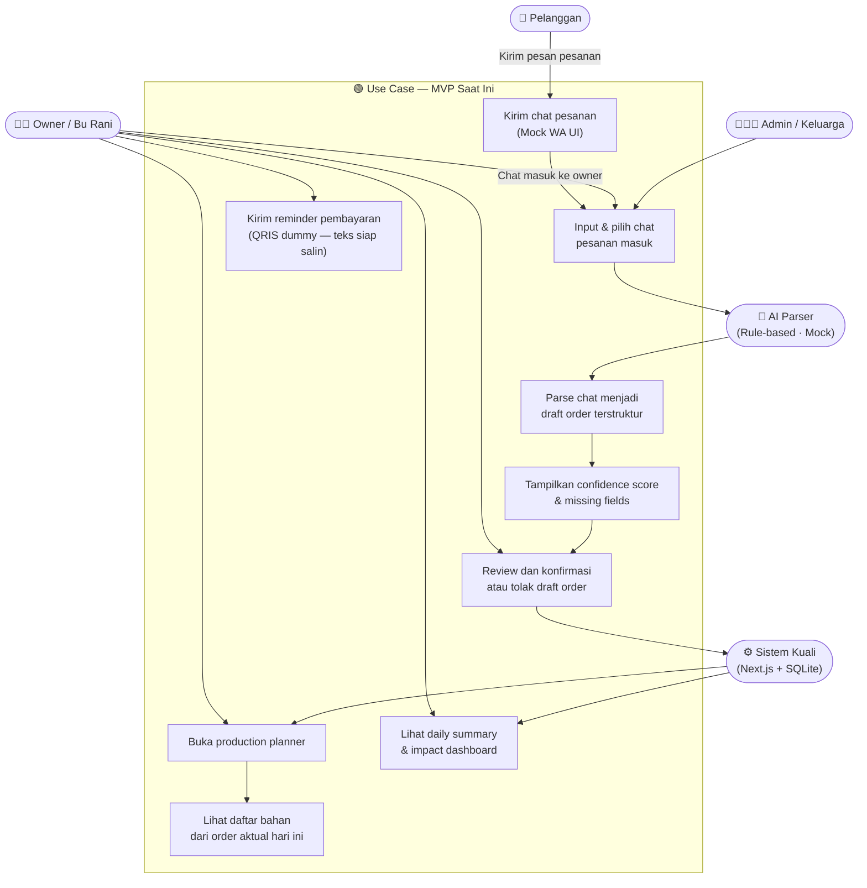
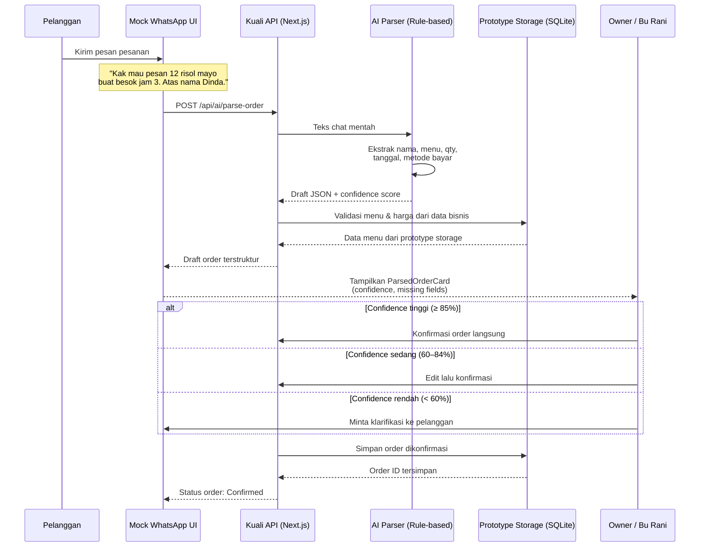
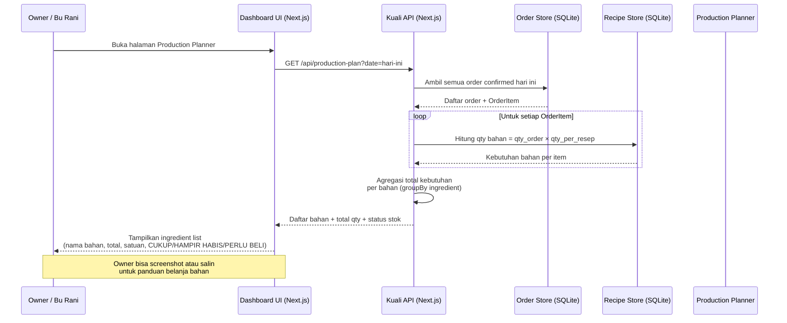
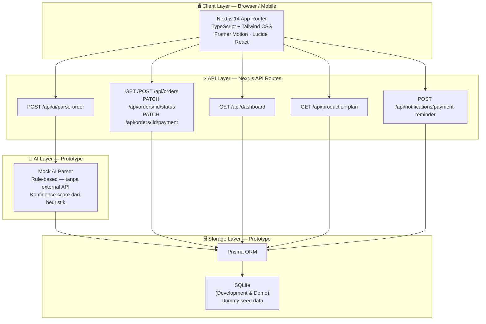
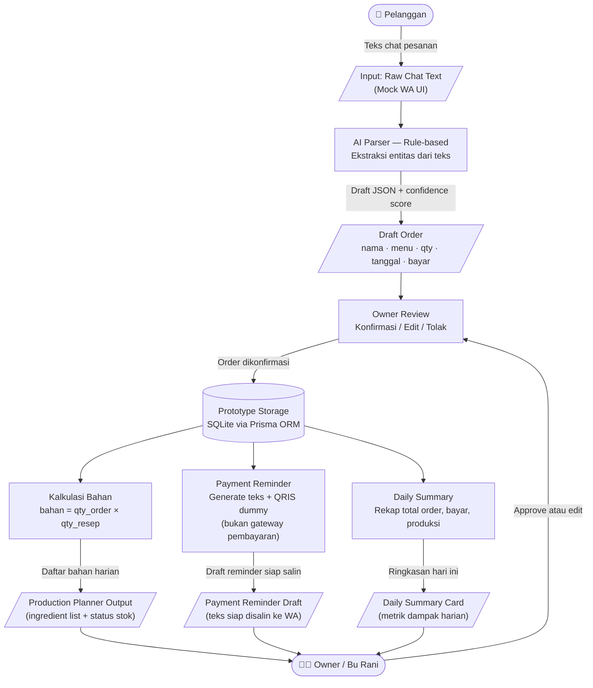
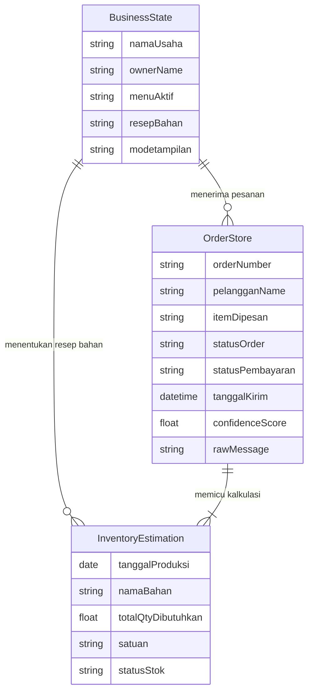

# 11 — Mermaid Diagrams

> **Diperbarui:** 2026-05-23
> **Dibuat oleh:** Claude Code — Technical Architect & Mermaid Diagram Specialist
> **Sumber:** 00_PROPOSAL_MASTER_KUALI.md · 04_HACKER_TECH_IMPLEMENTATION.md · 07_SCOPE_PURGE_AND_SIMPLIFICATION_REPORT.md · 99_FINAL_PROPOSAL_SUBMISSION.md
>
> **Cara preview:** Buka di VS Code → install "Markdown Preview Mermaid Support" (bitnoop) → Ctrl+Shift+V.
>
> **Cara export PNG/SVG:** `npx -p @mermaid-js/mermaid-cli mmdc -i 11_MERMAID_DIAGRAMS.md -o diagrams/ -e png`
> Atau copy blok ke [mermaid.live](https://mermaid.live) → Actions → Download SVG/PNG.
>
> **File .mmd tersedia di:** `docs/proposal/diagrams/` — satu file per diagram untuk batch export.

---

## Daftar Diagram

| ID | Nama | Tipe | Scope | Prioritas | Status |
|---|---|---|---|---|---|
| DIA-01 | Use Case Diagram | flowchart TD | MVP Saat Ini | P0 | ✅ DONE |
| DIA-02 | Sequence: Chat Order → Draft Order | sequenceDiagram | MVP Saat Ini | P0 | ✅ DONE |
| DIA-03 | Sequence: Production Planner | sequenceDiagram | MVP Saat Ini | P0 | ✅ DONE |
| DIA-04 | System Architecture | flowchart TB | MVP Saat Ini | P0 | ✅ DONE |
| DIA-05 | Data Flow Diagram | flowchart TD | MVP Saat Ini | P1 | ✅ DONE |
| DIA-06 | Simplified ERD — Konseptual | erDiagram | MVP Saat Ini | P0 | ✅ DONE |
| DIA-07 | Roadmap Architecture | flowchart LR | Roadmap Saja | P2 | ✅ DONE |

---

# BAGIAN A — Diagram MVP Saat Ini

> Semua diagram di bagian ini menggambarkan **prototype hackathon yang berjalan sekarang**.
> Stack aktual: Next.js 14 · SQLite (Prisma ORM) · Mock WhatsApp UI · Mock AI Parser (rule-based).
> Tidak ada Supabase, GCP, WhatsApp Cloud API, atau n8n dalam prototype saat ini.

---

## DIA-01 — Use Case Diagram

**Tujuan:** Menggambarkan semua aktor dan interaksi utama dalam sistem Kuali MVP.
**Scope:** Prototype hackathon — saat ini.
**Catatan juri:** Owner selalu memegang kendali di UC4. AI tidak pernah mengonfirmasi order secara otomatis.



---

## DIA-02 — Sequence Diagram: Chat Order → Draft Order

**Tujuan:** Menggambarkan alur dari pesan chat pelanggan masuk hingga owner mengonfirmasi order.
**Scope:** MVP — prototype. Storage menggunakan SQLite lokal, AI menggunakan mock rule-based parser.



---

## DIA-03 — Sequence Diagram: Production Planner

**Tujuan:** Menggambarkan kalkulasi kebutuhan bahan dari order yang sudah dikonfirmasi.
**Scope:** MVP — semua kalkulasi dilakukan dari resep yang tersimpan di prototype storage (SQLite). Bukan estimasi AI.



---

## DIA-04 — System Architecture Diagram

**Tujuan:** Menggambarkan lapisan teknologi sistem Kuali dari client hingga storage pada scope MVP.
**Scope:** MVP — prototype saat ini. Tidak ada cloud database, tidak ada external API, tidak ada n8n.



---

## DIA-05 — Data Flow Diagram

**Tujuan:** Menggambarkan alur data dari chat mentah hingga output ke owner (produksi, pembayaran, rekap).
**Scope:** MVP — seluruh alur berjalan di prototype lokal. Tidak ada external service.



---

## DIA-06 — Simplified ERD — Model Konseptual

**Tujuan:** Menggambarkan tiga entitas konseptual utama dalam sistem Kuali MVP.
**Scope:** Model konseptual — disederhanakan untuk proposal. Skema Prisma lengkap tersedia di `prisma/schema.prisma`.
**Catatan:** Prototype menggunakan single-tenant — satu bisnis per instance. Tidak ada autentikasi multi-user.



> **Keterangan status stok:** `CUKUP` · `HAMPIR HABIS` · `PERLU BELI`
> **Keterangan status order:** `PENDING` → `CONFIRMED` → `CANCELLED`
> **Keterangan status pembayaran:** `UNPAID` · `PARTIAL` · `PAID`

---

# BAGIAN B — Diagram Roadmap Masa Depan

> ⚠️ **BUKAN BAGIAN DEMO UTAMA.** Diagram ini menggambarkan arah pengembangan jangka panjang.
> Supabase, GCP, WhatsApp Cloud API, n8n, dan seluruh item di Roadmap Fase 1 & 2 **tidak tersedia** dalam prototype hackathon saat ini.
> Gunakan hanya untuk bagian Q&A juri atau Bab 5.2 Rencana Pengembangan dalam proposal.

---

## DIA-07 — Production Roadmap Architecture

**Tujuan:** Menggambarkan jalur pengembangan dari MVP ke sistem produksi penuh.
**Scope:** ROADMAP SAJA — bukan fitur saat ini.

```mermaid
flowchart LR
    subgraph MVP["🟢 MVP — Prototype Hackathon (Saat Ini)"]
        direction TB
        M1["Mock WhatsApp UI\n(Input manual chat)"]
        M2["Mock AI Parser\n(Rule-based · tanpa external API)"]
        M3["SQLite + Prisma ORM\n(Dev & Demo · dummy data)"]
        M4["QRIS Dummy Reminder\n(Teks siap salin · bukan gateway)"]
        M5["Production Planner\n(Kalkulasi dari resep lokal)"]
        M6["Daily Summary\n(Rekap otomatis)"]
    end

    subgraph R1["🔵 Roadmap Fase 1 — Post-Hackathon"]
        direction TB
        R1A["WhatsApp Business Cloud API\n(Meta · webhook nyata)"]
        R1B["Real AI Parser\n(OpenAI / Anthropic structured output)"]
        R1C["Supabase PostgreSQL\n(Multi-tenant · scalable)"]
        R1D["Real QRIS Payment Reminder\n(BI SNAP API · bukan settlement)"]
        R1E["Auth Multi-tenant\n(Owner + staff access)"]
    end

    subgraph R2["🟣 Roadmap Fase 2 — Skala"]
        direction TB
        R2A["Community Sourcing\n(Opt-in supplier pooling)"]
        R2B["Rescue Sale\n(Consent-based flash sale)"]
        R2C["GCP Cloud Run\n(Production deployment)"]
        R2D["SaaS Subscription\n(Freemium → Pro plan)"]
    end

    MVP -->|"Validasi product-market fit\npost-hackathon"| R1
    R1 -->|"Traction & revenue\nvalidation"| R2

    style MVP fill:#d4edda,stroke:#28a745,color:#000
    style R1 fill:#cce5ff,stroke:#004085,color:#000
    style R2 fill:#e2d9f3,stroke:#6f42c1,color:#000
```



**Label wajib dalam proposal:** Fase 1 dan Fase 2 harus disebutkan sebagai *rencana pengembangan lanjutan*, bukan fitur yang tersedia dalam prototype hackathon.

---

# Catatan Teknis Mermaid

| Isu | Penjelasan | Mitigasi |
|---|---|---|
| `subgraph` dengan `direction` | Hanya didukung Mermaid ≥ 9.0 | Jika gagal render, hapus `direction TB` di dalam subgraph |
| Label dengan `\n` | Baris baru dalam node label — Mermaid ≥ 8.x | Jika gagal, ganti dengan label satu baris |
| `Note over` dengan `<br/>` | HTML dalam note — didukung sebagian renderer | Jika gagal, ganti `<br/>` dengan spasi |
| Emoji dalam node label | Didukung sebagian renderer | Hapus emoji jika renderer PDF tidak mendukung unicode |
| `style` di flowchart | Dipakai di DIA-07 untuk warna zona | Hapus baris `style` jika renderer tidak mendukung |

---

# Cara Export PNG/SVG

### Opsi 1 — Mermaid Live (tanpa install, tercepat)
1. Buka [mermaid.live](https://mermaid.live)
2. Copy blok Mermaid (tanpa ` ```mermaid ` dan ` ``` `)
3. Paste ke editor kiri → Download PNG atau SVG dari tombol Actions

### Opsi 2 — CLI (batch export semua diagram sekaligus)
```bash
npx -p @mermaid-js/mermaid-cli mmdc \
  -i docs/proposal/11_MERMAID_DIAGRAMS.md \
  -o docs/proposal/diagrams/ \
  -e png \
  --backgroundColor white
```
Output: `docs/proposal/diagrams/11_MERMAID_DIAGRAMS-1.png` hingga `-7.png`

### Opsi 3 — Export per diagram via .mmd files
File .mmd sudah tersedia di `docs/proposal/diagrams/`:
```bash
npx -p @mermaid-js/mermaid-cli mmdc -i docs/proposal/diagrams/01_use_case_mvp.mmd -o docs/proposal/diagrams/01_use_case_mvp.png -e png --backgroundColor white
```

### Opsi 4 — VS Code Preview + Screenshot
1. Ctrl+Shift+V untuk preview
2. Klik kanan diagram → Save image, atau Snipping Tool (Win+Shift+S)

### Untuk proposal PDF
- Export DIA-01 hingga DIA-06 sebagai PNG → sisipkan di Bab 4 (Teknologi & Implementasi)
- Export DIA-07 sebagai PNG → sisipkan di Bab 5.2 (Rencana Pengembangan)
- Lampiran B: semua 7 diagram resolusi tinggi

> **Catatan re-rendering:** File SVG di `docs/proposal/` (`11_MERMAID_DIAGRAMS_rendered-*.svg`) dibuat dari versi sebelumnya dan perlu di-render ulang setelah revisi ini.

---

# Laporan Status

| Item | Status |
|---|---|
| DIA-01 Use Case | ✅ Diperbarui — ditambahkan aktor Pelanggan, Admin/Keluarga, Sistem Kuali |
| DIA-02 Sequence Chat→Order | ✅ Diperbarui — DB label: "Prototype Storage (SQLite)" |
| DIA-03 Sequence Production Planner | ✅ Diperbarui — DB labels: "Order Store" & "Recipe Store (SQLite)" |
| DIA-04 System Architecture | ✅ Bersih — tidak ada perubahan diperlukan |
| DIA-05 Data Flow Diagram | ✅ Bersih — tidak ada perubahan diperlukan |
| DIA-06 Simplified ERD | ✅ Diganti — model konseptual 3-entitas (BusinessState / OrderStore / InventoryEstimation) |
| DIA-07 Roadmap Architecture | ✅ Diperbarui — ditambahkan R1E (Auth Multi-tenant), warning diperkuat |
| Scope MVP terjaga | ✅ Supabase/GCP/WhatsApp API/n8n hanya di DIA-07 Bagian B |
| .mmd files | ✅ Dibuat di `docs/proposal/diagrams/` — 7 file |
| SVG files existing | ⚠️ Perlu di-render ulang — versi lama di `docs/proposal/*.svg` |
