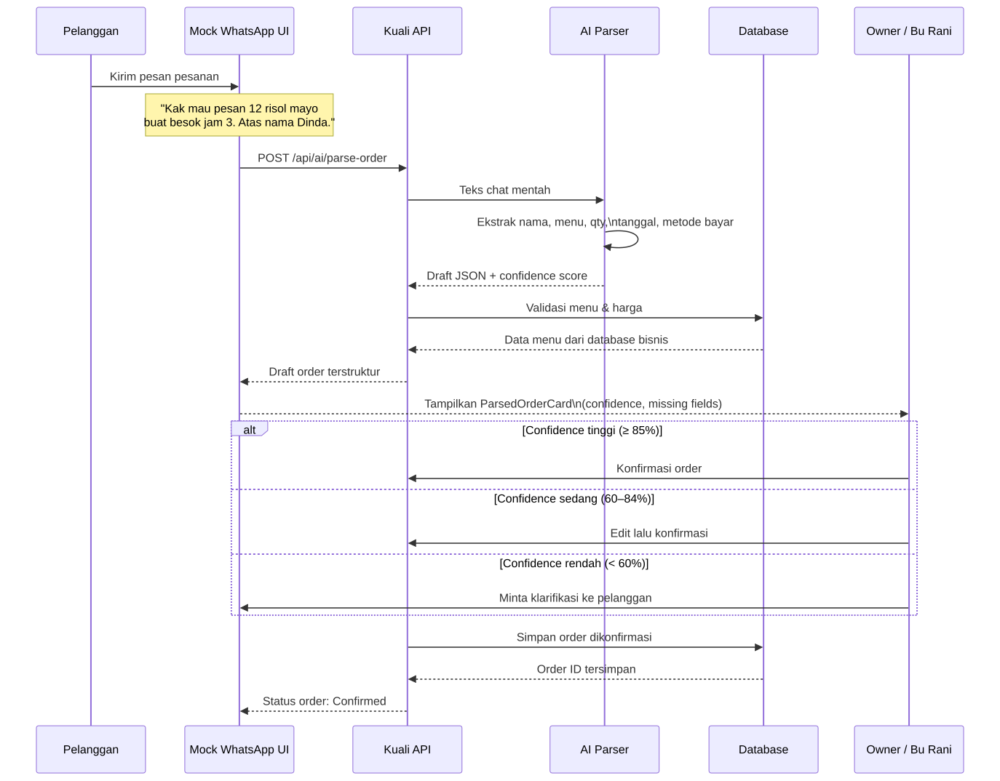
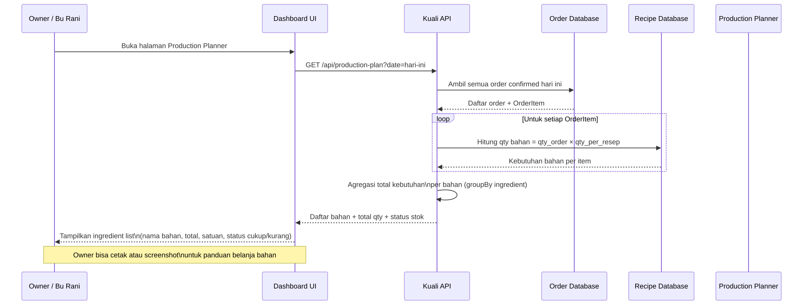

# 11 — Mermaid Diagrams

> Dibuat: 2026-05-18
> Dibuat oleh: Claude Code — Technical Architect & Mermaid Diagram Specialist
> Sumber: 00_PROPOSAL_MASTER_KUALI.md, 04_HACKER_TECH_IMPLEMENTATION.md, 05_DIAGRAMS_AND_MOCKUP_PLAN.md, 99_FINAL_PROPOSAL_SUBMISSION.md
>
> **Cara preview:** Buka file ini di VS Code → install extension "Markdown Preview Mermaid Support" (bitnoop) atau "Mermaid Preview" (vstirbu) → tekan Ctrl+Shift+V untuk preview.
>
> **Cara export PNG/SVG:** Gunakan mermaid-js CLI (`npx -p @mermaid-js/mermaid-cli mmdc -i file.md -o diagram.png`) atau copy blok mermaid ke mermaid.live kemudian export.

---

## Daftar Diagram

| ID | Nama | Tipe | Prioritas | Status |
|---|---|---|---|---|
| DIA-01 | Use Case Diagram | flowchart TD | P0 | ✅ DONE |
| DIA-02 | Sequence: Chat Order → Draft Order | sequenceDiagram | P0 | ✅ DONE |
| DIA-03 | Sequence: Production Planner | sequenceDiagram | P0 | ✅ DONE |
| DIA-04 | System Architecture Diagram | flowchart TB | P0 | ✅ DONE |
| DIA-05 | Data Flow Diagram | flowchart TD | P1 | ✅ DONE |
| DIA-06 | Entity Relationship Diagram (ERD) | erDiagram | P0 | ✅ DONE |
| DIA-07 | Roadmap Architecture Diagram | flowchart LR | P2 | ✅ DONE |

---

## DIA-01 — Use Case Diagram

Menggambarkan aktor dan use case utama dalam sistem Kuali MVP.



**Catatan juri:** Owner selalu memegang kendali di UC4 — AI tidak pernah mengonfirmasi order secara otomatis.

---

## DIA-02 — Sequence Diagram: Chat Order → Draft Order

Menggambarkan alur dari pesan chat pelanggan masuk hingga owner mengonfirmasi order ke sistem.



---

## DIA-03 — Sequence Diagram: Production Planner

Menggambarkan alur kalkulasi kebutuhan bahan dari order yang sudah dikonfirmasi.



---

## DIA-04 — System Architecture Diagram

Menggambarkan lapisan teknologi sistem Kuali dari client hingga database pada scope MVP.



---

## DIA-05 — Data Flow Diagram

Menggambarkan alur data dari chat mentah masuk hingga output yang diterima owner (produksi, pembayaran, rekap).



---

## DIA-06 — Entity Relationship Diagram (ERD)

Menggambarkan relasi antar entitas database pada scope MVP Kuali.



---

## DIA-07 — Roadmap Architecture Diagram

Menggambarkan evolusi arsitektur Kuali dari MVP prototype hingga visi roadmap. **Diagram ini hanya untuk menunjukkan arah pengembangan — bukan bagian MVP yang didemonstrasikan.**



**Label wajib dalam proposal:** Fase 1 dan Fase 2 harus disebutkan sebagai *rencana pengembangan lanjutan*, bukan fitur yang tersedia dalam prototype hackathon.

---

## Catatan Syntax Mermaid

| Isu | Penjelasan | Mitigasi |
|---|---|---|
| `subgraph` dengan `direction` | Hanya didukung Mermaid ≥ 9.0. VS Code Mermaid extension umumnya sudah versi baru | Jika gagal render, hapus `direction TB` di dalam subgraph |
| Label dengan `\n` | Baris baru dalam node label — didukung di Mermaid ≥ 8.x | Jika gagal, ganti dengan label satu baris |
| `Note over` dengan `<br/>` | HTML dalam note — didukung oleh sebagian renderer | Jika gagal, ganti `<br/>` dengan spasi |
| ERD label dengan spasi | Mermaid ERD menggunakan `"label dalam kutip"` untuk relasi — sudah diterapkan | Pastikan tidak ada kutip tunggal dalam label |
| Emoji dalam node label | Didukung di sebagian renderer. Jika gagal di PDF, hapus emoji | Hapus karakter emoji jika renderer PDF tidak mendukung unicode |
| `style` di flowchart | Dipakai di DIA-07 untuk warna MVP/Roadmap | Jika renderer tidak mendukung, hapus baris `style` |

---

## Next Step: Export ke PNG/SVG

### Opsi 1 — Mermaid Live (tanpa install)
1. Buka [mermaid.live](https://mermaid.live)
2. Copy blok Mermaid (tanpa ` ```mermaid ` dan ` ``` `)
3. Paste ke editor kiri
4. Download PNG atau SVG dari tombol Actions

### Opsi 2 — CLI (untuk batch export)
```bash
npm install -g @mermaid-js/mermaid-cli
mmdc -i 11_MERMAID_DIAGRAMS.md -o diagrams/ -e png
```
Ini akan mengekstrak semua blok Mermaid dan mengekspornya sebagai file PNG terpisah.

### Opsi 3 — VS Code Screenshot
1. Buka preview (Ctrl+Shift+V)
2. Klik kanan diagram → Save image
3. Atau screenshot dan crop dengan Snipping Tool (Win+Shift+S)

### Untuk proposal PDF
- Export semua 7 diagram sebagai PNG
- Sisipkan di Bab 4 (Teknologi & Implementasi) untuk DIA-01 hingga DIA-06
- DIA-07 Roadmap sisipkan di Bab 5 (Kesimpulan & Roadmap)
- Lampiran B dapat berisi semua diagram dalam resolusi tinggi

---

## Laporan Status

| Item | Status |
|---|---|
| DIA-01 Use Case | ✅ Dibuat — flowchart TD, aktor dan UC jelas |
| DIA-02 Sequence Chat→Order | ✅ Dibuat — confidence score branching ada |
| DIA-03 Sequence Production Planner | ✅ Dibuat — loop kalkulasi bahan per item ada |
| DIA-04 System Architecture | ✅ Dibuat — API routes spesifik, no roadmap items |
| DIA-05 Data Flow Diagram | ✅ Dibuat — external entity, proses, data store |
| DIA-06 ERD | ✅ Dibuat — 10 entitas, field detail untuk Order/Menu/Ingredient |
| DIA-07 Roadmap Architecture | ✅ Dibuat — 3 fase dengan warna berbeda, label eksplisit |
| File app code diubah | ✅ Tidak ada — hanya docs/ |
| Scope MVP terjaga | ✅ Roadmap hanya di DIA-07 dengan label jelas |
