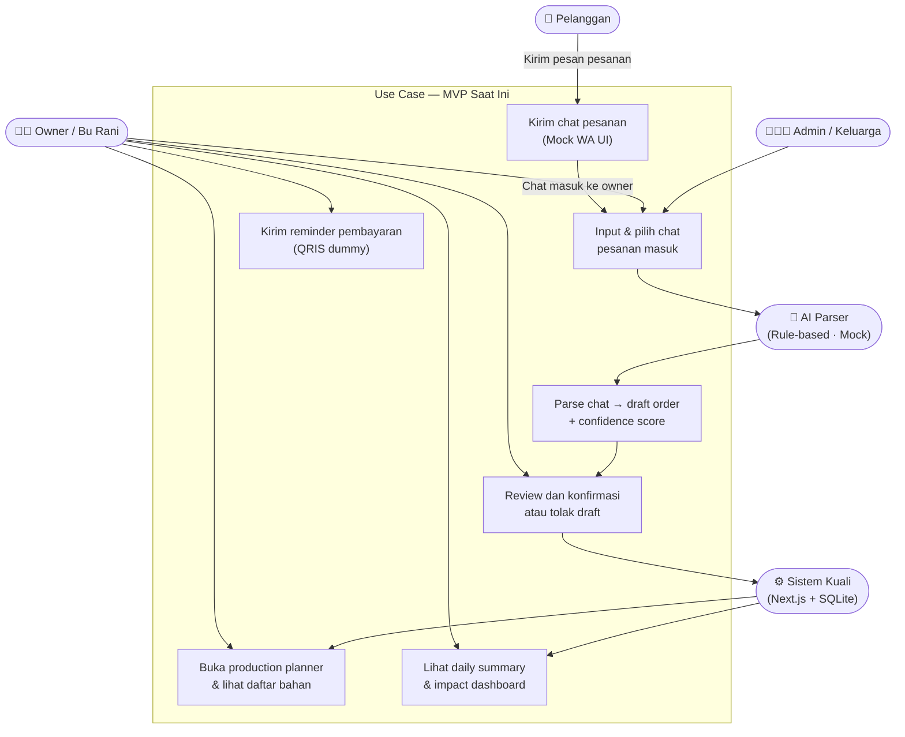
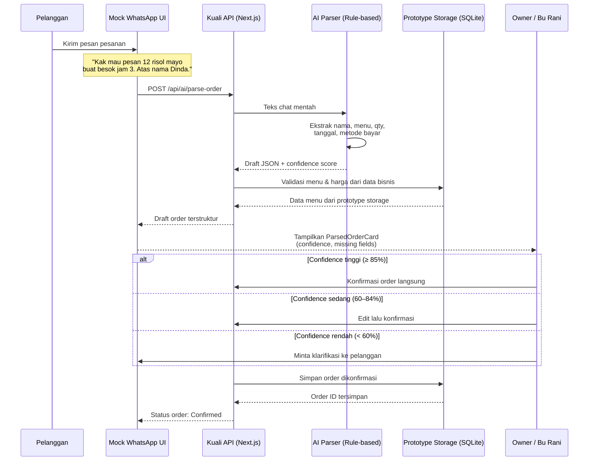
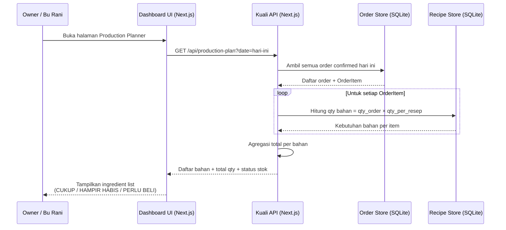
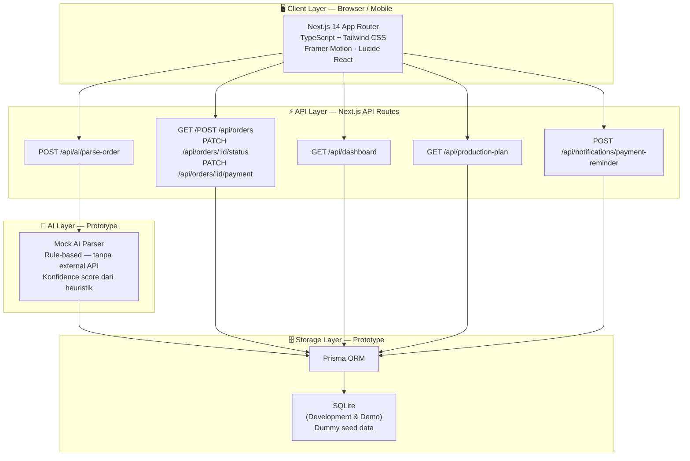
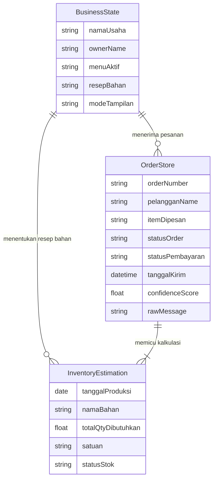

# Proposal Kuali — Order Rapi, Produksi Siap

## Cover

**Judul Proposal:** Kuali — Order Rapi, Produksi Siap
**Event:** Gunadarma Code Week 2.0
**Subtema:** Food & Culinary Business Tech
**Nama Tim:** [NAMA TIM]

**Anggota Tim:**
- [Nama 1] — Leader / Hacker
- [Nama 2] — Hacker
- [Nama 3] — Hacker
- [Nama 4] — Hustler
- [Nama 5] — Hipster

---

## Daftar Isi

1. Pendahuluan
   - 1.1 Latar Belakang
   - 1.2 Masalah yang Ingin Diselesaikan
   - 1.3 Mengapa Masalah Ini Penting
   - 1.4 Tujuan Solusi
   - 1.5 Manfaat bagi Pengguna
2. Business & Market Strategy
   - 2.1 Business Model Canvas
   - 2.2 Analisis Kompetitor
   - 2.3 Analisis SWOT
   - 2.4 Strategi Go-To-Market
3. User Experience & Design
   - 3.1 User Persona Utama — Bu Rani
   - 3.2 User Journey
   - 3.3 Alur Layar Produk (Mockup)
   - 3.4 Prinsip UX
   - 3.5 Desain Inklusif — Mode Sederhana dan Mode Standar
4. Teknologi & Implementasi
   - 4.1 Pemanfaatan AI
   - 4.2 Use Case Diagram (Tekstual)
   - 4.3 Sequence Diagram (Mermaid)
   - 4.4 System Design
   - 4.5 Keamanan, Privasi, dan Etika
5. Kesimpulan & Rencana Pengembangan
   - 5.1 Kesimpulan
   - 5.2 Rencana Pengembangan (Roadmap)
   - 5.3 Tantangan dan Mitigasi
6. Daftar Pustaka
7. Lampiran Opsional

---

## 1. Pendahuluan

### 1.1 Latar Belakang

Indonesia memiliki jutaan pelaku usaha mikro dan kecil di sektor kuliner. Catering rumahan, nasi box, snack box, bakery rumahan, dessert box, frozen food, kopi literan, dan usaha pre-order makanan lainnya merupakan bagian nyata dari perekonomian lokal yang dekat dengan kehidupan masyarakat sehari-hari. [NEED SOURCE: jumlah UMKM aktif di Indonesia — Kementerian Koperasi dan UKM / BPS]

Banyak dari pelaku usaha ini telah memanfaatkan teknologi digital dalam kegiatan jualannya. WhatsApp menjadi salah satu kanal utama yang mereka pilih untuk menerima pesanan langsung dari pelanggan. Hal ini bukan karena keterbatasan, melainkan karena WhatsApp memang sudah menjadi infrastruktur komunikasi sehari-hari yang dipercaya pelanggan. [NEED SOURCE: persentase penggunaan WhatsApp sebagai kanal komunikasi usaha — We Are Social / DataReportal]

Dengan kata lain, UMKM kuliner ini sudah aktif menjalankan aktivitas digital. Tantangan yang mereka hadapi bukan soal "belum memanfaatkan teknologi". Tantangannya ada di lapisan yang berbeda: **proses operasional di belakang chat yang masih sering dilakukan secara manual.**

Ketika pesanan masuk melalui WhatsApp, pemilik usaha masih perlu membaca pesan satu per satu, mencatat pesanan secara manual, memantau status pembayaran sendiri, menghitung kebutuhan bahan berdasarkan perkiraan, dan menyusun rekap harian jika ada waktu tersisa. Proses-proses ini berjalan setiap hari, berulang, dan semakin berat saat volume pesanan meningkat.

Kuali hadir untuk membantu merapikan lapisan operasional ini — tidak mengubah cara UMKM berjualan, tetapi memperkuat fondasi di balik aktivitas yang sudah mereka jalankan setiap hari.

### 1.2 Masalah yang Ingin Diselesaikan

Kuali berfokus pada lima masalah operasional utama yang dihadapi UMKM kuliner WhatsApp-first:

1. **Rekap order dari WhatsApp dilakukan secara manual.** Pesanan masuk dari banyak kontak berbeda, tersebar di antara pesan pribadi dan notifikasi lain, tanpa sistem yang memisahkan chat pesanan dari chat biasa.

2. **Pesanan berpotensi terlewat atau salah jumlah.** Tanpa sistem pencatatan yang terstruktur, satu pesanan yang tidak terbaca dapat merusak kepercayaan pelanggan setia.

3. **Status pembayaran sulit dipantau.** Pemilik usaha harus mengingat sendiri siapa yang sudah membayar dan siapa yang belum, tanpa notifikasi atau daftar yang bisa diakses kapan saja.

4. **Estimasi kebutuhan bahan masih menggunakan perkiraan.** Tidak ada sistem yang menghitung secara otomatis berapa bahan yang harus disiapkan berdasarkan pesanan yang sudah dikonfirmasi.

5. **Owner sering mengelola semuanya sendiri tanpa admin khusus.** Semua tanggung jawab operasional — dari pencatatan pesanan hingga pengiriman — jatuh ke satu orang, sehingga kesalahan kecil berdampak langsung pada layanan dan reputasi.

### 1.3 Mengapa Masalah Ini Penting

Masalah-masalah di atas bukan sekadar ketidaknyamanan kecil. Dampaknya nyata dan berulang setiap hari:

- **Waktu dan energi owner** tersita untuk kegiatan administratif yang seharusnya bisa diotomasi.
- **Akurasi pesanan** terancam ketika rekap dilakukan dari ingatan atau catatan yang tidak terstruktur.
- **Kelancaran pembayaran** terganggu ketika tidak ada mekanisme pengingat yang mudah digunakan.
- **Kesiapan bahan produksi** menjadi tidak menentu ketika perhitungan masih berbasis perkiraan.
- **Kepuasan pelanggan** berisiko turun ketika pesanan terlewat atau terlambat dikonfirmasi.
- **Potensi pertumbuhan usaha** terbatas karena kapasitas owner untuk menangani volume order yang lebih tinggi bergantung pada sistem yang lebih baik, bukan hanya pada kerja keras lebih panjang.

Dengan merapikan lapisan operasional ini, UMKM kuliner memiliki fondasi yang lebih kuat untuk tumbuh tanpa harus menambah beban kerja secara proporsional.

### 1.4 Tujuan Solusi

Kuali bertujuan untuk:

- Membantu pemilik usaha mengubah chat pesanan WhatsApp menjadi draft order yang terstruktur dan dapat dicek.
- Membantu mengingatkan pembayaran melalui reminder QRIS dummy yang siap dikirim ke pelanggan.
- Membantu menghitung kebutuhan bahan produksi berdasarkan pesanan aktual yang sudah dikonfirmasi.
- Membantu menghasilkan rekap harian secara otomatis tanpa perlu rekap manual.
- Menjaga pemilik usaha tetap memegang kendali penuh — AI hanya membantu membuat draft, setiap keputusan tetap di tangan owner.

### 1.5 Manfaat bagi Pengguna

**Owner UMKM kuliner:**
- Menghemat waktu rekap manual setiap hari.
- Mengurangi risiko pesanan terlewat atau salah catat.
- Memudahkan pemantauan status pembayaran.
- Mendapat daftar bahan produksi yang lebih akurat dari perkiraan.
- Mendapat rekap harian tanpa harus menyusunnya sendiri.

**Pelanggan:**
- Respons konfirmasi pesanan lebih cepat dan konsisten.
- Pengalaman pemesanan yang lebih rapi meski tetap melalui WhatsApp yang sudah familiar.

**Tim produksi:**
- Daftar bahan yang harus disiapkan lebih jelas dan terhitung dari pesanan nyata.
- Produksi dapat direncanakan dengan lebih baik sejak pagi hari.

*Fitur komunitas (community sourcing, supplier pooling, rescue sale) adalah bagian dari roadmap jangka panjang — tidak termasuk dalam MVP ini. Lihat Bagian 5.2.*

---

## 2. Business & Market Strategy

### 2.1 Business Model Canvas

| Blok | Isi |
|------|-----|
| Customer Segments | UMKM kuliner WhatsApp-first: catering rumahan, nasi box, snack box, bakery rumahan, dessert box, frozen food, kopi literan, pre-order makanan |
| Value Propositions | Mengubah chat WhatsApp menjadi draft order terstruktur; reminder pembayaran QRIS dummy; production planner dari order aktual; daily summary otomatis; AI hanya membuat draft — owner tetap memegang kendali |
| Channels | Demo langsung, komunitas UMKM kuliner, media sosial, word-of-mouth, kampus (mahasiswa yang berjualan) |
| Customer Relationships | Self-service dashboard; owner approval setiap order; AI sebagai asisten bukan pengganti |
| Revenue Streams | (Roadmap) Freemium dengan fitur dasar gratis; langganan bulanan untuk fitur lengkap |
| Key Resources | Mock AI parser; dashboard web; menu dan resep sederhana; Prisma + SQLite (prototype) |
| Key Activities | Parsing chat order; owner approval flow; production planner; payment reminder; daily summary |
| Key Partnerships | (Roadmap) WhatsApp Business API; supplier bahan lokal; komunitas UMKM |
| Cost Structure | Infrastruktur cloud (Vercel); development; WhatsApp API cost (roadmap) |

### 2.2 Analisis Kompetitor

Kuali tidak berusaha menggantikan semua solusi yang sudah ada. Kuali mengisi celah spesifik yang belum dilayani dengan baik: **operasional order dari chat WhatsApp untuk UMKM kuliner pre-order yang tidak memiliki admin khusus.**

| Alternatif | Apa yang Diselesaikan | Kesenjangan | Diferensiasi Kuali |
|---|---|---|---|
| WhatsApp Business biasa | Komunikasi pelanggan | Tidak ada rekap order, tidak ada production planner | Kuali menambahkan layer operasional di atas WhatsApp |
| POS (Majoo, Qasir) | Transaksi kasir | Dimulai dari kasir, bukan dari chat pre-order | Kuali dimulai dari chat sebelum transaksi final |
| BukuWarung / BukuKas | Pencatatan keuangan | Tidak parsing chat, tidak production planner | Kuali fokus pada order operation bukan hanya keuangan |
| Spreadsheet / buku manual | Rekap manual | Tidak ada AI, tidak ada structured output | Kuali mengotomasi draft, owner tetap validasi |
| ChatGPT biasa | Menjawab pertanyaan umum | Output bebas, tidak terstruktur, tidak terhubung ke menu/resep | Kuali menghasilkan structured JSON yang divalidasi backend |
| Admin manusia | Semua operasional | Mahal, terbatas waktu | Kuali membantu operasional dasar tanpa mengganti peran manusia |

### 2.3 Analisis SWOT

**Strengths (Kekuatan Internal):**
- WhatsApp-first sesuai kebiasaan dan alur kerja target pengguna
- AI parser ringan tanpa external API untuk prototype — feasible dalam hackathon
- Owner approval di setiap langkah menjaga kepercayaan pengguna
- Mobile-first dan ringan untuk pengguna Android mid-low

**Weaknesses (Kelemahan Internal):**
- MVP masih prototype — belum production-ready
- AI parser berbasis mock rules, belum menggunakan real language model
- Belum ada autentikasi multi-tenant untuk penggunaan oleh banyak UMKM sekaligus
- Membutuhkan input data menu dan resep di awal sebelum dapat digunakan optimal

**Opportunities (Peluang Eksternal):**
- Banyak UMKM kuliner sudah aktif berjualan melalui WhatsApp [NEED SOURCE]
- Pertumbuhan penggunaan QR payment di kalangan UMKM Indonesia [NEED SOURCE: Bank Indonesia — QRIS adoption]
- Potensi pengembangan fitur komunitas sourcing berbasis consent sebagai differensiator *(roadmap jangka panjang — tidak termasuk prototype hackathon)*
- Tingkat kenyamanan digital yang bervariasi antar pelaku UMKM membuka peluang desain inklusif yang belum diakomodasi tools yang ada

**Threats (Ancaman Eksternal):**
- Pesaing POS besar dengan sumber daya dan ekosistem lebih besar
- Perubahan kebijakan WhatsApp Business API yang dapat mempengaruhi roadmap integrasi
- Kenyamanan adopsi teknologi baru bervariasi — membutuhkan onboarding yang ringkas dan tampilan yang tidak mengintimidasi

### 2.4 Strategi Go-To-Market

Strategi awal Kuali berfokus pada segmen yang spesifik: UMKM kuliner pre-order yang menerima pesanan melalui WhatsApp, aktif di lingkungan kampus dan komunitas lokal.

**Tahap Awal:**
- Target pengguna pertama berasal dari lingkungan kampus — mahasiswa yang berjualan snack box dan katering — serta komunitas UMKM kuliner rumahan di sekitar tim.
- Demo dilakukan secara langsung menggunakan alur WhatsApp-first yang familiar, sehingga calon pengguna dapat langsung memahami manfaat tanpa perlu pelatihan panjang.

**Model Distribusi:**
- Web app yang dapat diakses melalui browser mobile — tidak perlu install aplikasi terpisah.
- Demo video pendek yang menunjukkan alur dari chat masuk hingga production planner.
- Word-of-mouth dari komunitas katering dan snack box yang sudah menggunakan.

**Model Pendapatan (Roadmap):**
- Fitur dasar gratis untuk membangun kepercayaan dan basis pengguna awal.
- Langganan bulanan untuk fitur lanjutan seperti production planner penuh, daily summary, dan history order. Harga perlu divalidasi melalui riset willingness-to-pay sebelum ditetapkan.
- Potensi kemitraan dengan komunitas UMKM dan koperasi lokal untuk distribusi dan onboarding.

### 2.5 Metrik Dampak yang Dapat Diukur

Kuali mengukur dampak melalui metrik operasional yang dapat diobservasi secara langsung dari penggunaan prototype, tanpa membuat klaim bisnis yang belum terverifikasi.

| Metrik | Cara Ukur | Target Prototype |
|---|---|---|
| Jumlah chat order yang berhasil diparse menjadi draft terstruktur | Log AI parser | ≥ 80% dari total chat yang dimasukkan |
| Jumlah draft order yang dikonfirmasi owner | Data order dengan status confirmed | Dapat dimonitor per sesi demo |
| Jumlah reminder pembayaran yang disiapkan sistem | Log notifikasi | 1 reminder per order unpaid |
| Waktu rata-rata dari chat masuk hingga draft tersedia | Timestamp parse vs timestamp order | < 3 detik per chat (mock parser) |
| Kelengkapan production planner dari order aktual | Bahan tercakup vs total bahan dibutuhkan | 100% bahan dari menu yang ada di database resep |
| Ketersediaan daily summary otomatis | Summary terbentuk setiap akhir hari | Tersedia tanpa input manual dari owner |

**Catatan metodologi:** Semua data di atas adalah dari sesi simulasi prototype menggunakan data dummy. Tidak ada klaim efisiensi atau penghematan waktu yang dibuat tanpa validasi lapangan. Metrik ini dirancang untuk dapat diukur dan diverifikasi pada fase pengujian lapangan pasca-hackathon.

---

## 3. User Experience & Design

### 3.1 User Persona Utama — Bu Rani

| Aspek | Detail |
|---|---|
| Nama | Bu Rani |
| Jenis Usaha | Catering rumahan, nasi box |
| Kanal Jualan | WhatsApp, grup pelanggan, Instagram Story, repeat order |
| Volume Order | 20–50 pesanan/hari saat ramai |
| Device | Android mid-low, sering dipakai sambil produksi |
| Ukuran Tim | Sendiri atau dibantu anggota keluarga, tidak ada admin khusus |
| Pain Utama | Order tercecer, pembayaran perlu dicek satu per satu, bahan dihitung pakai perkiraan |
| Takut | Salah order, pelanggan kecewa, bahan kurang/berlebih, lupa tagih |
| Butuh | Order rapi, reminder pembayaran, daftar bahan, rekap harian |
| Tampilan yang cocok | Mode Sederhana — fokus ke aksi utama tanpa grafik |

**Jobs-To-Be-Done Bu Rani:**
- Bu Rani tidak butuh POS canggih — ia butuh order dari WhatsApp tidak tercecer.
- Bu Rani tidak butuh dashboard analis — ia butuh rasa tenang bahwa semua pesanan tercatat.
- Bu Rani tidak butuh forecasting kompleks — ia butuh daftar bahan yang harus disiapkan dari pesanan nyata.
- Bu Rani tidak butuh AI yang memutuskan — ia butuh AI yang membantu buat draft agar ia bisa cek sendiri.

**Persona Sekunder 1 — Mas Budi (Penjual Snack Box / Pre-order):**
Mahasiswa atau fresh graduate yang berjualan risol, snack box, atau makanan ringan pre-order melalui WhatsApp grup teman kampus dan kantor. Volume 10–30 pesanan per hari atau minggu. Pain utama: pesanan kecil tapi banyak varian, reminder pembayaran mudah terlupa. Butuh: draft order cepat, reminder, rekap sederhana. Tampilan cocok: **Mode Standar** — terbiasa membaca angka dan tabel.

**Persona Sekunder 2 — Kak Rina (Bakery / Dessert Rumahan):**
Pelaku usaha bakery atau dessert rumahan yang melayani pesanan acara khusus dan repeat order. Volume bervariasi, pesanan sering memiliki tanggal pengiriman berbeda dan varian yang detail. Pain utama: banyak pesanan beda tanggal dan item, kebutuhan bahan harus tepat karena barang tidak tahan lama. Butuh: order detail, tanggal ambil jelas, estimasi bahan akurat. Tampilan cocok: **Mode Standar** — membutuhkan detail operasional lengkap.

**Persona Aksesibilitas — Owner dengan Kenyamanan Digital Rendah:**
Pemilik usaha yang terbiasa dengan WhatsApp, tetapi kurang nyaman membaca grafik, tabel, atau istilah teknis di layar HP. Bukan soal usia — kenyamanan digital setiap orang berbeda. Yang dibutuhkan: tombol besar, teks langsung ke aksi, tanpa grafik yang membutuhkan interpretasi. Tampilan cocok: **Mode Sederhana** — fokus ke pesanan, pembayaran, dan bahan. Kuali tidak meminta pengguna memasukkan usia atau menentukan kategori kemampuan — pilihan tampilan tersedia secara langsung dan dapat diubah kapan saja.

### 3.2 User Journey

**Sebelum Kuali — Alur Bu Rani Setiap Hari:**

1. Pagi: WhatsApp dibuka, belasan chat masuk dari berbagai kontak bersamaan.
2. Bu Rani membaca pesan satu per satu, mencatat pesanan di buku atau notes HP.
3. Sebelum belanja bahan, Bu Rani menghitung kebutuhan dari ingatan dan catatan kasar.
4. Sore: Bu Rani mengecek rekening dan dompet digital satu per satu untuk memastikan siapa yang sudah bayar.
5. Malam: rekap harian dibuat manual jika ada waktu tersisa — atau tidak dibuat sama sekali.

**Sesudah Kuali — Alur yang Dibantu:**

1. Chat WhatsApp masuk seperti biasa dari pelanggan.
2. Bu Rani membuka Kuali, memilih chat pesanan yang masuk.
3. AI membaca chat dan membuat draft order terstruktur: nama, menu, jumlah, tanggal, status bayar.
4. Bu Rani mereview draft, memastikan kebenarannya, lalu menekan tombol Konfirmasi. Atau menolak jika ada yang salah.
5. Sistem menyimpan order yang dikonfirmasi dan memperbarui production planner secara otomatis.
6. Reminder pembayaran QRIS dummy siap disalin dan dikirim ke pelanggan oleh Bu Rani.
7. Di akhir hari, daily summary tersedia otomatis: total order, yang belum bayar, bahan yang harus disiapkan besok.

### 3.3 Alur Layar Produk (Mockup)

Kuali dirancang sebagai web app mobile-first dengan layar-layar berikut:

1. **Landing / Hero** — pengenalan produk singkat, CTA ke demo.
2. **Mock WhatsApp UI** — input chat pesanan, preset chat dummy untuk demo.
3. **AI Parsed Draft Order** — card order terstruktur dengan confidence score dan missing field indicator.
4. **Owner Approval Screen** — konfirmasi atau penolakan draft oleh owner, dengan ringkasan order.
5. **Dashboard Mode Sederhana** — tampilan ringkas untuk owner yang ingin aksi langsung: Pesanan Perlu Dicek, Pelanggan Belum Bayar, Bahan untuk Besok, Rekap Hari Ini. Tombol besar, tanpa grafik.
6. **Dashboard Mode Standar** — tampilan lengkap dengan metric cards, grafik tren, tabel order terbaru, dan confidence score. Untuk owner atau admin yang membutuhkan detail operasional.
7. **Daftar Order** — dengan filter status (semua, draft, dikonfirmasi, belum bayar).
8. **Detail Order** — informasi lengkap order, confidence bar, missing fields, aksi approve/edit/tolak.
9. **Payment Reminder QRIS Dummy** — preview reminder dengan QRIS dummy, tombol salin pesan, disclaimer jelas bahwa ini bukan settlement.
10. **Production Planner** — daftar bahan yang harus disiapkan berdasarkan order aktual yang dikonfirmasi, dengan perbandingan stok tersedia.
11. **Daily Summary** — rekap harian: total order, dikonfirmasi, belum bayar, bahan utama produksi besok.
12. **Impact Dashboard** — metrik operasional dari data demo: jumlah chat diparse, order dikonfirmasi, reminder siap, bahan terhitung.
13. **Profil Usaha** — informasi dasar usaha (nama, jenis, area, WhatsApp, menu aktif, QRIS dummy, preferensi tampilan). Ringan dan tidak meminta data personal yang tidak diperlukan MVP.

*Catatan: Fitur roadmap (community sourcing, rescue sale, supplier pooling) tidak termasuk dalam layar demo utama. Jika ada pertanyaan juri, tersedia di Bagian 5.2.*

### 3.4 Prinsip UX

- **Mobile-first (360–430px):** Semua layar dirancang untuk layar HP Android ukuran sedang ke bawah. Tombol dengan tinggi minimum 52px agar mudah disentuh satu tangan.
- **Bahasa Indonesia sederhana:** Tidak ada istilah teknis atau Bahasa Inggris tanpa konteks. Teks tombol menggunakan kata kerja: Konfirmasi, Simpan, Salin, Kirim.
- **Status langsung terbaca:** Badge berwarna untuk setiap status order dan pembayaran — tidak perlu membaca keterangan panjang.
- **Pilihan tampilan adaptif:** Kuali menyediakan dua mode tampilan — Mode Sederhana untuk aksi cepat tanpa grafik, dan Mode Standar untuk detail operasional lengkap. Pengguna memilih berdasarkan kenyamanan, bukan berdasarkan kategori usia atau kemampuan.
- **Low cognitive load:** Mode Sederhana membatasi informasi di layar pertama menjadi maksimal 4 kartu aksi utama. Tidak ada angka yang perlu diinterpretasi — hanya aksi yang perlu dilakukan.
- **Tidak terlihat seperti POS kasir:** Tidak ada tampilan struk, meja, printer, atau multi-cabang. Kuali adalah alat operasional chat, bukan sistem kasir.
- **Owner selalu punya kontrol penuh:** Setiap hasil AI ditampilkan sebagai draft. Tidak ada satu pun order yang dikonfirmasi tanpa persetujuan eksplisit dari owner.

### 3.5 Desain Inklusif — Mode Sederhana dan Mode Standar

Kuali memahami bahwa pelaku UMKM mikro memiliki tingkat kenyamanan digital yang berbeda-beda. Bukan soal usia — seorang pemilik warung berusia 28 tahun bisa lebih nyaman dengan tampilan sederhana, sementara pemilik katering berusia 50 tahun terbiasa membaca laporan keuangan di spreadsheet. Kenyamanan digital ditentukan oleh pengalaman dan kebiasaan, bukan angka tahun lahir.

Karena itu, Kuali menyediakan dua mode tampilan yang bisa dipilih sendiri oleh pengguna kapan saja, tanpa perlu mengisi formulir profil atau menjawab pertanyaan tentang kemampuan digital:

**Mode Sederhana**
Tampilan difokuskan pada 4 kartu aksi utama: pesanan baru masuk, order perlu dikonfirmasi, pembayaran belum diterima, dan rencana produksi hari ini. Tidak ada grafik, tidak ada tabel angka panjang, tidak ada istilah teknis. Setiap kartu memiliki satu tombol aksi yang jelas — pengguna tahu langsung apa yang harus dilakukan berikutnya.

**Mode Standar**
Tampilan penuh dengan metrik operasional: total order, breakdown status, ringkasan pembayaran, grafik harian, dan daftar order lengkap. Cocok untuk owner yang ingin gambaran lengkap operasional sebelum memulai hari.

Pengguna bisa berpindah mode kapan saja dengan toggle yang terlihat di sudut kanan atas dashboard. Tidak ada mode yang "lebih rendah" atau "lebih mudah" — keduanya adalah pilihan tampilan yang setara. Kuali tidak menyimpan mode pengguna sebagai data profil yang dikirim ke server; pilihan disimpan secara lokal di perangkat.

**Prinsip desain inklusif Kuali:**
- Tidak ada pertanyaan tentang usia, tingkat pendidikan, atau kemampuan teknologi.
- Pilihan tampilan tersedia untuk semua pengguna secara langsung.
- Label dan teks menggunakan kata kerja aksi, bukan jargon teknis.
- Ukuran tombol minimum 52px × 44px — dapat disentuh dengan satu jari di HP Android ukuran sedang.
- Kontras warna minimum 4.5:1 pada semua teks penting.

---

## 4. Teknologi & Implementasi

### 4.1 Pemanfaatan AI

AI digunakan dalam Kuali untuk empat fungsi spesifik:

**1. AI Order Parser**
Membaca teks chat pesanan dalam Bahasa Indonesia — termasuk variasi informal, typo, dan kalimat tidak lengkap — lalu menghasilkan structured JSON yang berisi: nama pelanggan, daftar menu dan jumlah, tanggal dan waktu pengiriman, metode pengambilan, status pembayaran, dan catatan khusus.

**2. Confidence Score**
Setiap hasil parsing diberi skor kepercayaan (0–100%). Skor tinggi (lebih dari 85%) berarti informasi dalam chat cukup lengkap untuk diapprove langsung. Skor rendah menandai bahwa ada informasi yang ambigu atau tidak lengkap dan perlu dicek owner sebelum dikonfirmasi.

**3. Missing Field Detector**
Menandai secara otomatis informasi yang tidak disebutkan dalam chat — misalnya tanggal pengiriman atau status pembayaran — sehingga owner tahu apa yang perlu dikonfirmasi ulang ke pelanggan.

**4. Suggested Reply**
Menghasilkan draft balasan konfirmasi dalam Bahasa Indonesia yang sopan, siap disalin dan dikirim oleh owner. Owner bisa edit sebelum mengirim.

**5. Daily Summary Wording**
Menyusun narasi ringkasan harian dalam Bahasa Indonesia yang sederhana dan mudah dibaca.

**Batas Penggunaan AI (penting):**

AI dalam Kuali tunduk pada batasan yang ketat:
- AI tidak mengarang menu atau harga yang tidak ada di database bisnis.
- AI tidak mengubah status pembayaran menjadi lunas tanpa input eksplisit dari owner.
- AI tidak mengirim pesan ke pelanggan tanpa persetujuan owner.
- Kalkulasi bahan menggunakan logika backend dan data resep — bukan AI generatif.
- Setiap hasil AI bersifat draft. **Human-in-the-loop:** setiap order harus melalui owner approval sebelum dikonfirmasi ke sistem.

### 4.2 Use Case Diagram

**Aktor dalam sistem Kuali:**

- **Pelanggan:** Mengirim pesan pesanan melalui WhatsApp. Dalam prototype, chat pelanggan dimasukkan manual melalui Mock WhatsApp UI.
- **Owner (Bu Rani):** Pemilik UMKM kuliner yang menggunakan Kuali setiap hari. Mereview draft order, mengonfirmasi atau menolak, memantau dashboard, melihat production planner.
- **Admin / Keluarga:** Anggota keluarga atau asisten yang membantu owner dalam mengoperasikan dashboard — dapat menggunakan fitur yang sama dengan owner di prototype single-tenant.
- **AI Parser (Mock):** Mengekstrak informasi dari chat masuk secara rule-based, menghasilkan confidence score, membuat draft order terstruktur.
- **Sistem Kuali:** Menyimpan dan memvalidasi order, menghitung kebutuhan bahan dari data resep, menghasilkan rekap harian.

**Use Cases Utama:**

1. Pelanggan mengirim pesan pesanan — diterima owner melalui WhatsApp.
2. Owner (atau Admin) memasukkan chat ke Mock WhatsApp UI, memilih chat pesanan yang akan diproses.
3. AI Parser mem-parse teks chat menjadi draft order terstruktur dengan confidence score dan missing fields.
4. Owner mereview draft dan mengonfirmasi, mengedit, atau menolak.
5. Sistem menyimpan order yang dikonfirmasi ke prototype storage.
6. Sistem menghitung kebutuhan bahan dari semua order dikonfirmasi menggunakan data resep.
7. Owner membuka production planner dan melihat daftar bahan harian.
8. Owner menyalin dan mengirim reminder pembayaran QRIS dummy ke pelanggan yang belum bayar.
9. Owner membuka daily summary dan impact dashboard untuk melihat rekap hari ini.



### 4.3 Sequence Diagram (Mermaid)

**Sequence 1: Chat Order → Draft Order**



**Sequence 2: Production Planner**



### 4.4 System Design

---

#### 4.4.1 Arsitektur Prototype Babak 1

Prototype Kuali dibangun dengan arsitektur yang dapat dijalankan, didemonstrasikan, dan diverifikasi sepenuhnya dalam lingkungan lokal maupun cloud hosting standar. Semua komponen yang tercantum di bawah ini adalah komponen yang **aktif berjalan** dalam prototype hackathon ini.

**Stack Teknologi — Aktif di Prototype Saat Ini:**

| Layer | Teknologi | Keterangan |
|---|---|---|
| Framework | Next.js 14 App Router | Frontend + API Routes dalam satu codebase |
| Language | TypeScript | Type safety tanpa overhead setup terpisah |
| Styling | Tailwind CSS + design tokens | Responsive, mobile-first (360–430px) |
| Animation | Framer Motion | Transisi UI halus tanpa library besar |
| Icons | Lucide React | Icon konsisten dan ringan |
| Toast | Sonner | Notifikasi dalam-app |
| ORM | Prisma ORM | Type-safe query; skema sebagai single source of truth |
| Database | SQLite | Prototype lokal — satu file, zero-config, zero server |
| AI Parser | Mock rule-based parser | Ekstraksi entitas dari teks; tanpa external API |
| Payment | QRIS dummy reminder | Teks siap salin — bukan payment gateway, bukan settlement |
| Deployment | Vercel | Zero-config deployment dari Git push |

**Diagram Arsitektur — Prototype Aktif:**



**Model Data Konseptual:**



> Skema Prisma lengkap (10 entitas) tersedia di `prisma/schema.prisma`. Model di atas adalah representasi konseptual untuk kemudahan pembacaan proposal.

**API Endpoints — Aktif di Prototype:**

| Method | Endpoint | Fungsi |
|---|---|---|
| GET | /api/health | Health check |
| GET | /api/dashboard | Metrik harian |
| GET | /api/orders | Daftar order |
| POST | /api/orders | Buat order |
| GET | /api/orders/:id | Detail order |
| PATCH | /api/orders/:id/status | Update status order |
| PATCH | /api/orders/:id/payment | Update status pembayaran |
| GET | /api/menus | Daftar menu |
| GET | /api/ingredients | Daftar bahan |
| POST | /api/ai/parse-order | AI parsing dari teks chat |
| GET | /api/production-plan | Production planner harian |
| POST | /api/notifications/payment-reminder | Reminder pembayaran dummy |

---

#### 4.4.2 Alasan Menggunakan Arsitektur Ringan

Pilihan SQLite, mock AI parser, dan Next.js API Routes bukan keterbatasan — ini adalah keputusan teknis yang disengaja untuk konteks hackathon. Setiap pilihan dapat diganti dengan komponen production-grade tanpa mengubah logika aplikasi:

**SQLite, bukan PostgreSQL:**
Prisma sebagai ORM mendukung migrasi database tanpa perubahan kode aplikasi. SQLite di prototype, PostgreSQL di produksi — skema tetap sama, `prisma migrate` menangani sisanya. SQLite dipilih karena zero-config, portabel dalam satu file, dan tidak membutuhkan server database terpisah. Untuk membuktikan alur order, ini lebih dari cukup.

**Mock AI parser, bukan external LLM:**
Parser rule-based bekerja secara offline, deterministik, dan bebas latency jaringan maupun biaya API. Output formatnya identik dengan yang akan dihasilkan oleh OpenAI atau Anthropic structured output — hanya provider-nya yang berbeda. Menukar mock parser dengan real LLM tidak memerlukan perubahan pada API contract atau frontend.

**Next.js API Routes, bukan backend terpisah:**
Menghilangkan kebutuhan dua deployment (frontend + backend), mengurangi kompleksitas konfigurasi, dan mempercepat development dalam waktu hackathon yang terbatas. Untuk produksi dengan skala lebih tinggi, API Routes dapat dipisah ke layanan mandiri tanpa mengubah endpoint contract.

**Vercel, bukan GCP:**
Deployment dari Git push dengan SSL otomatis dan preview URL per branch. Untuk volume hackathon demo, ini sudah lebih dari cukup. Migrasi ke GCP Cloud Run di roadmap tidak mengubah kode aplikasi.

**Kesimpulan:** Arsitektur ini dipilih bukan karena tidak bisa lebih kompleks — melainkan karena kompleksitas yang tidak diperlukan di tahap ini akan memperlambat validasi hipotesis inti: *"apakah alur order dari chat WhatsApp bisa dibuat lebih terstruktur dengan AI-assisted parsing dan human-in-the-loop approval?"*

---

#### 4.4.3 Rencana Arsitektur Production

Komponen-komponen berikut adalah **rencana pengembangan pasca-hackathon** yang akan diimplementasikan setelah validasi product-market fit dengan pengguna nyata. **Tidak satu pun dari ini aktif di prototype Babak 1.**

| Layer | Teknologi (Roadmap) | Keterangan |
|---|---|---|
| Database | PostgreSQL via Supabase atau Cloud SQL | Multi-tenant, scalable, backup otomatis |
| WhatsApp | Meta WhatsApp Business Cloud API | Integrasi langsung dengan webhook — setelah review dan approval Meta |
| AI Parser | OpenAI / Anthropic structured output | Parsing lebih akurat untuk teks informal Bahasa Indonesia |
| Deployment | GCP Cloud Run | Auto-scaling, production-grade reliability |
| Secret Management | Google Secret Manager / Vercel Env | Pengelolaan credential aman untuk API key dan database |
| Auth | NextAuth.js / Supabase Auth | Multi-tenant dengan isolasi data per bisnis |
| Logging | GCP Cloud Logging | Observability, audit trail, dan debugging produksi |
| Payment Reminder | BI SNAP API | Reminder nyata — bukan settlement, bukan payment gateway |
| Consent Management | Opt-in database per pelanggan | Untuk fitur broadcast di Roadmap Fase 2 |

---

#### 4.4.4 Batasan Implementasi Saat Ini

Batasan berikut adalah **keputusan scope yang disengaja** untuk hackathon Babak 1, bukan kekurangan desain:

| Batasan | Status | Penjelasan |
|---|---|---|
| Single-tenant | Disengaja | Satu bisnis per instance. Multi-tenant diimplementasikan setelah validasi PMF |
| Tidak ada autentikasi | Disengaja | Demo tidak membutuhkan auth. Produksi menggunakan auth yang proper dan aman |
| SQLite | Disengaja | Cukup untuk demo. Prisma ORM memudahkan migrasi ke PostgreSQL tanpa ubah kode |
| Mock AI parser | Disengaja | Membuktikan alur tanpa biaya API. Output format identik dengan real LLM |
| Mock WhatsApp UI | Disengaja | Meta WhatsApp Business API memerlukan proses review — ada di roadmap Fase 1 |
| QRIS dummy | Disengaja | Kuali bukan payment gateway. Reminder nyata via BI SNAP API ada di roadmap |
| Tidak ada logging | Disengaja | Tidak diperlukan untuk hackathon demo |
| Data dummy | Disengaja | Seluruh data adalah data simulasi — tidak ada data pelanggan nyata yang diproses |

---

#### 4.4.5 Risiko dan Mitigasi Teknis

| Risiko | Dampak | Mitigasi |
|---|---|---|
| AI parser salah ekstrak entitas dari teks informal | Draft order tidak akurat | Confidence score + missing field indicator + owner approval wajib di setiap order |
| AI menyebut harga yang tidak ada di database menu | Misinformasi order | Harga selalu diambil dari database menu — AI tidak menentukan atau mengarang harga |
| Demo error atau crash saat presentasi | Demonstrasi terganggu | Dummy seed data statik sebagai fallback; semua alur sudah diuji dari end-to-end |
| Parser tidak mengenali variasi Bahasa Indonesia informal | Confidence rendah | Owner approval + klarifikasi ke pelanggan sebagai fallback yang jelas di UI |
| Scope creep ke fitur roadmap | Prototype tidak selesai tepat waktu | Boundary MVP terdokumentasi dan dijaga ketat di seluruh tim |
| Pertanyaan juri soal WhatsApp/QRIS nyata | Ekspektasi yang meleset | Mock UI + disclaimer eksplisit di setiap layar; jawaban Q&A sudah disiapkan |

### 4.5 Keamanan, Privasi, dan Etika

**Minimasi data:** Kuali hanya menyimpan data yang benar-benar diperlukan untuk menjalankan fungsi operasional order. Tidak ada data pelanggan yang dikumpulkan di luar kebutuhan fungsional.

**Data dummy untuk prototype:** Seluruh data yang digunakan dalam demonstrasi prototype adalah data dummy yang dibuat untuk keperluan demo. Tidak ada data pelanggan nyata yang diproses.

**Tidak ada transaksi keuangan nyata:** QRIS yang ditampilkan dalam Kuali adalah dummy — bukan payment gateway. Kuali tidak memproses atau menyimpan dana dalam bentuk apapun.

**Kontrol penuh di tangan owner:** Setiap hasil AI bersifat draft. Owner harus secara eksplisit menyetujui sebelum order dikonfirmasi ke sistem. AI tidak bertindak secara otomatis.

**Consent untuk fitur komunitas (roadmap):** Fitur broadcast atau community sourcing yang direncanakan di roadmap akan selalu berbasis opt-in eksplisit dari pengguna — tidak pernah otomatis.

---

## 5. Kesimpulan & Rencana Pengembangan

### 5.1 Kesimpulan

Kuali menjawab gap operasional yang nyata di balik aktivitas jual-beli UMKM kuliner melalui WhatsApp. UMKM kuliner ini sudah aktif berjualan — tantangannya bukan adopsi teknologi baru, melainkan merapikan proses di balik aktivitas yang sudah berjalan setiap hari.

MVP Kuali tetap fokus pada inti permasalahan: merapikan alur order dari chat, mengingatkan pembayaran, dan menyiapkan production planner dari pesanan aktual. AI digunakan sebagai alat bantu pembuatan draft — bukan sebagai pengambil keputusan.

Prototype Kuali sudah dapat didemonstrasikan secara end-to-end: dari chat masuk hingga production planner siap dan daily summary tersedia, dengan human-in-the-loop di setiap langkah penting.

Kuali bukan POS. Bukan marketplace. Bukan chatbot biasa. Kuali adalah asisten operasional WhatsApp-first yang bekerja di atas kebiasaan yang sudah ada — menjadikan alur kerja Bu Rani lebih rapi tanpa mengubah cara ia berjualan.

### 5.2 Rencana Pengembangan (Roadmap)

Fitur-fitur berikut adalah **rencana pengembangan pasca-MVP** dan bukan bagian dari prototype hackathon ini. Fitur roadmap hanya akan dikembangkan setelah validasi dari pengguna nyata.

1. **Integrasi WhatsApp Business Cloud API** — Memungkinkan parsing langsung dari pesan WhatsApp tanpa perlu copy-paste. Memerlukan persetujuan dari Meta dan proses review Business Verification.
2. **Auth multi-tenant** — Satu sistem melayani banyak UMKM dengan data yang terpisah dan aman.
3. **Customer opt-in/opt-out system** — Pelanggan dapat memilih untuk menerima atau tidak menerima notifikasi dari sistem.
4. **Community sourcing** — UMKM sekitar dapat menggabungkan kebutuhan bahan untuk pembelian bersama. Berbasis consent pengguna — bukan broadcast otomatis.
5. **Supplier pooling berbasis consent** — Jaringan supplier bahan baku lokal yang terhubung ke UMKM yang sudah opt-in.
6. **Rescue sale opt-in** — Mekanisme menawarkan sisa stok ke pelanggan yang sudah opt-in. Bukan broadcast otomatis.
7. **SaaS pricing dan billing** — Model berlangganan untuk akses fitur lengkap. Harga akan ditentukan setelah validasi willingness-to-pay.
8. **Google Cloud / GCP production deployment** — Deployment skala produksi dengan keandalan dan keamanan yang lebih tinggi.

### 5.3 Tantangan dan Mitigasi

*Catatan: Risiko dan mitigasi teknis dibahas secara lengkap di §4.4.5. Bagian ini fokus pada tantangan produk dan adopsi.*

| Tantangan | Mitigasi |
|---|---|
| Validasi pengguna nyata belum dilakukan | User testing dengan UMKM kuliner lokal dijadwalkan sebagai prioritas pertama pasca-hackathon sebelum pengembangan lebih lanjut |
| Onboarding owner yang sibuk dan waktu terbatas | UI mobile-first; onboarding minimal — cukup masukkan 3–5 menu utama untuk mulai menggunakan production planner |
| Privasi data pelanggan saat produksi | Minimasi data di semua titik; consent opt-in eksplisit untuk fitur broadcast di roadmap; data dummy untuk prototype |
| Adopsi teknologi baru untuk owner yang tidak terbiasa | Mode Sederhana sebagai entry point — tidak ada grafik, tidak ada jargon; dapat beralih ke Mode Standar kapan saja |
| Ketergantungan pada WhatsApp sebagai kanal utama | Mock UI berfungsi tanpa WhatsApp API; integrasi real dikembangkan di roadmap setelah review Meta |

---

## 6. Daftar Pustaka

> Catatan: Referensi di bawah ini adalah placeholder. Tim perlu mengganti semua [NEED SOURCE] dengan sumber yang terverifikasi sebelum submission final. Jangan mengarang atau memperkirakan statistik.

1. [NEED SOURCE] Jumlah UMKM aktif di Indonesia dan kontribusi terhadap PDB — Kementerian Koperasi dan UKM / BPS.
2. [NEED SOURCE] Persentase UMKM kuliner yang menggunakan WhatsApp sebagai kanal penjualan — survei industri / laporan riset.
3. [NEED SOURCE] Penetrasi penggunaan WhatsApp di Indonesia — We Are Social / DataReportal Digital Report.
4. [NEED SOURCE] Adopsi QRIS di kalangan pelaku usaha kecil — Bank Indonesia.
5. [NEED SOURCE] Tantangan digitalisasi operasional UMKM — laporan riset LPEM FEB UI / World Bank / Kementerian terkait.
6. Meta. (2024). *WhatsApp Business Platform Documentation*. Meta for Developers. https://developers.facebook.com/docs/whatsapp
7. Prisma. (2024). *Prisma ORM Documentation*. Prisma. https://www.prisma.io/docs
8. Vercel. (2024). *Next.js Deployment Documentation*. Vercel. https://vercel.com/docs

---

## 7. Lampiran Opsional

### Lampiran A — Mockup Screens

> [Akan dilampirkan dalam versi PDF — tangkapan layar dari prototype yang berjalan di localhost:3000 atau Vercel preview URL]
>
> Layar yang dilampirkan: Landing, Mock WhatsApp UI, AI Parsed Draft Order, Owner Approval, Dashboard Hari Ini, Production Planner, Daily Summary.

### Lampiran B — Diagram Teknis

> [Akan dilampirkan — ERD database, sequence diagram, system design diagram dalam format gambar atau render Mermaid]

### Lampiran C — Contoh Output AI Parser

```json
{
  "chatId": "chat-001",
  "customerName": "Dinda Ayu",
  "items": [
    {
      "menu": "Risol Mayo",
      "qty": 12,
      "unitPrice": 3500,
      "subtotal": 42000
    }
  ],
  "deliveryDate": "Besok, 23 Mei 2026",
  "deliveryTime": "15:00",
  "paymentStatus": "unpaid",
  "paymentNote": "Bayar nanti sore",
  "pickupMethod": "delivery",
  "confidenceScore": 95,
  "missingFields": [],
  "needsOwnerReview": false,
  "suggestedReply": "Halo Kak Dinda, pesanan 12 risol mayo untuk besok jam 3 sudah kami catat ya. Kami akan kirimkan info pembayaran sore ini. Terima kasih!"
}
```

### Lampiran D — Task Board

> [Akan dilampirkan — screenshot atau export dari task board tim yang menunjukkan pembagian tugas per role: Hustler, Hipster, Hacker]

### Lampiran E — Daftar Risiko dan Mitigasi

> [Telah dibahas secara lengkap pada Bagian 5.3]

---

*Dokumen ini adalah draft proposal untuk review leader. Belum dalam format PDF final.*
*Tanggal terakhir diperbarui: 2026-05-23*
*Versi: 1.2 — Technology section rewrite: prototype vs roadmap separation, §4.4 restructured into 5 subsections, §4.2 updated with all actors, §4.3 sequence diagram participant labels updated*
