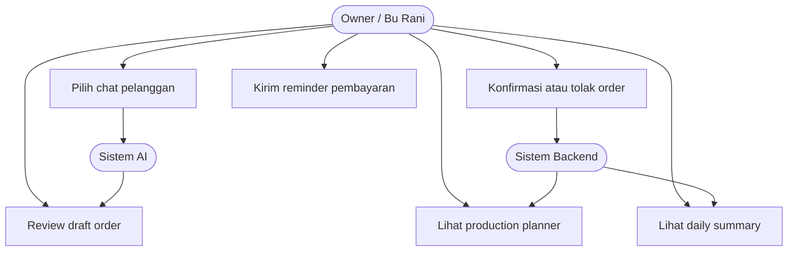
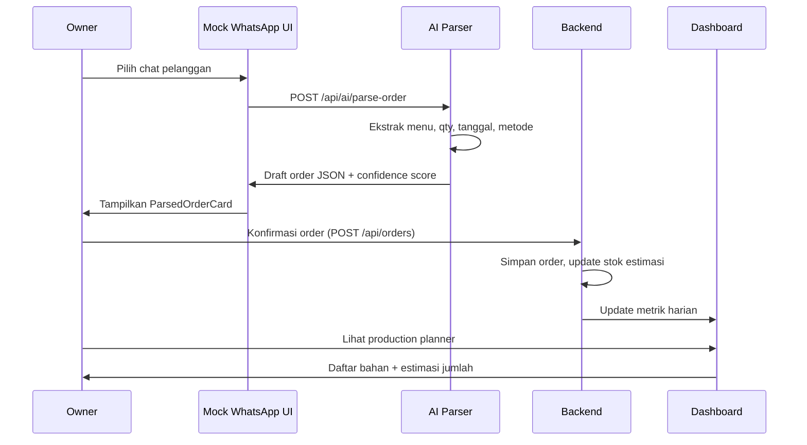
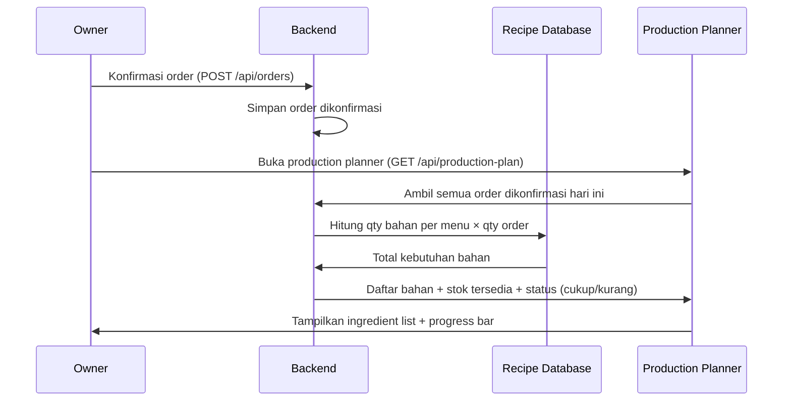
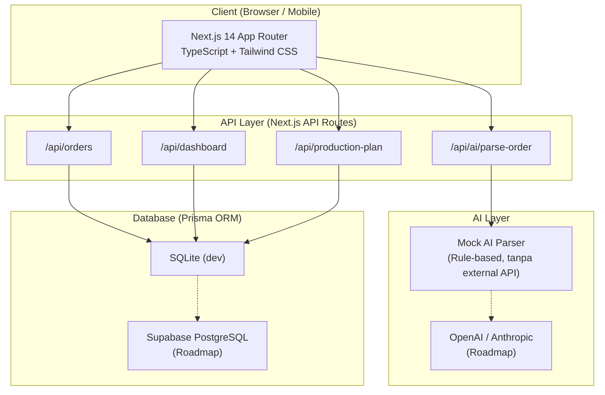
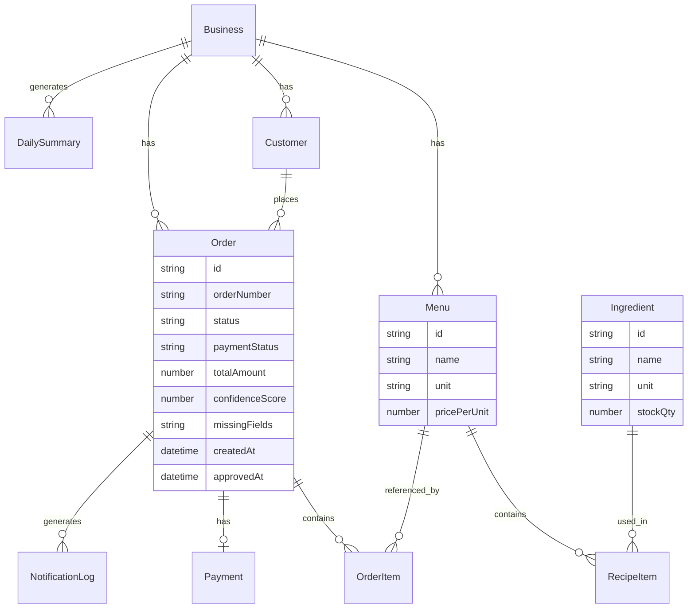

# Proposal Kuali — Order Rapi, Produksi Siap

## Cover

**Judul Proposal:** Kuali — Order Rapi, Produksi Siap
**Event:** Gunadarma Code Week 2.0
**Subtema:** Food & Culinary Business Tech
**Nama Tim:** [NAMA TIM]

**Anggota Tim:**
- [Nama 1] — Leader / Hacker
- [Nama 2] — Hacker
- [Nama 3] — Hacker
- [Nama 4] — Hustler
- [Nama 5] — Hipster

---

## Daftar Isi

1. Pendahuluan
   - 1.1 Latar Belakang
   - 1.2 Masalah yang Ingin Diselesaikan
   - 1.3 Mengapa Masalah Ini Penting
   - 1.4 Tujuan Solusi
   - 1.5 Manfaat bagi Pengguna
2. Business & Market Strategy
   - 2.1 Business Model Canvas
   - 2.2 Analisis Kompetitor
   - 2.3 Analisis SWOT
   - 2.4 Strategi Go-To-Market
3. User Experience & Design
   - 3.1 User Persona Utama — Bu Rani
   - 3.2 User Journey
   - 3.3 Alur Layar Produk (Mockup)
   - 3.4 Prinsip UX
4. Teknologi & Implementasi
   - 4.1 Pemanfaatan AI
   - 4.2 Use Case Diagram (Tekstual)
   - 4.3 Sequence Diagram (Mermaid)
   - 4.4 System Design
   - 4.5 Keamanan, Privasi, dan Etika
5. Kesimpulan & Rencana Pengembangan
   - 5.1 Kesimpulan
   - 5.2 Rencana Pengembangan (Roadmap)
   - 5.3 Tantangan dan Mitigasi
6. Daftar Pustaka
7. Lampiran Opsional

---

## 1. Pendahuluan

### 1.1 Latar Belakang

Indonesia memiliki jutaan pelaku usaha mikro dan kecil di sektor kuliner. Catering rumahan, nasi box, snack box, bakery rumahan, dessert box, frozen food, kopi literan, dan usaha pre-order makanan lainnya merupakan bagian nyata dari perekonomian lokal yang dekat dengan kehidupan masyarakat sehari-hari. [NEED SOURCE: jumlah UMKM aktif di Indonesia — Kementerian Koperasi dan UKM / BPS]

Banyak dari pelaku usaha ini telah memanfaatkan teknologi digital dalam kegiatan jualannya. WhatsApp menjadi salah satu kanal utama yang mereka pilih untuk menerima pesanan langsung dari pelanggan. Hal ini bukan karena keterbatasan, melainkan karena WhatsApp memang sudah menjadi infrastruktur komunikasi sehari-hari yang dipercaya pelanggan. [NEED SOURCE: persentase penggunaan WhatsApp sebagai kanal komunikasi usaha — We Are Social / DataReportal]

Dengan kata lain, UMKM kuliner ini sudah aktif menjalankan aktivitas digital. Tantangan yang mereka hadapi bukan soal "belum memanfaatkan teknologi". Tantangannya ada di lapisan yang berbeda: **proses operasional di belakang chat yang masih sering dilakukan secara manual.**

Ketika pesanan masuk melalui WhatsApp, pemilik usaha masih perlu membaca pesan satu per satu, mencatat pesanan secara manual, memantau status pembayaran sendiri, menghitung kebutuhan bahan berdasarkan perkiraan, dan menyusun rekap harian jika ada waktu tersisa. Proses-proses ini berjalan setiap hari, berulang, dan semakin berat saat volume pesanan meningkat.

Kuali hadir untuk membantu merapikan lapisan operasional ini — tidak mengubah cara UMKM berjualan, tetapi memperkuat fondasi di balik aktivitas yang sudah mereka jalankan setiap hari.

### 1.2 Masalah yang Ingin Diselesaikan

Kuali berfokus pada lima masalah operasional utama yang dihadapi UMKM kuliner WhatsApp-first:

1. **Rekap order dari WhatsApp dilakukan secara manual.** Pesanan masuk dari banyak kontak berbeda, tersebar di antara pesan pribadi dan notifikasi lain, tanpa sistem yang memisahkan chat pesanan dari chat biasa.

2. **Pesanan berpotensi terlewat atau salah jumlah.** Tanpa sistem pencatatan yang terstruktur, satu pesanan yang tidak terbaca dapat merusak kepercayaan pelanggan setia.

3. **Status pembayaran sulit dipantau.** Pemilik usaha harus mengingat sendiri siapa yang sudah membayar dan siapa yang belum, tanpa notifikasi atau daftar yang bisa diakses kapan saja.

4. **Estimasi kebutuhan bahan masih menggunakan perkiraan.** Tidak ada sistem yang menghitung secara otomatis berapa bahan yang harus disiapkan berdasarkan pesanan yang sudah dikonfirmasi.

5. **Owner sering mengelola semuanya sendiri tanpa admin khusus.** Semua tanggung jawab operasional — dari pencatatan pesanan hingga pengiriman — jatuh ke satu orang, sehingga kesalahan kecil berdampak langsung pada layanan dan reputasi.

### 1.3 Mengapa Masalah Ini Penting

Masalah-masalah di atas bukan sekadar ketidaknyamanan kecil. Dampaknya nyata dan berulang setiap hari:

- **Waktu dan energi owner** tersita untuk kegiatan administratif yang seharusnya bisa diotomasi.
- **Akurasi pesanan** terancam ketika rekap dilakukan dari ingatan atau catatan yang tidak terstruktur.
- **Kelancaran pembayaran** terganggu ketika tidak ada mekanisme pengingat yang mudah digunakan.
- **Kesiapan bahan produksi** menjadi tidak menentu ketika perhitungan masih berbasis perkiraan.
- **Kepuasan pelanggan** berisiko turun ketika pesanan terlewat atau terlambat dikonfirmasi.
- **Potensi pertumbuhan usaha** terbatas karena kapasitas owner untuk menangani volume order yang lebih tinggi bergantung pada sistem yang lebih baik, bukan hanya pada kerja keras lebih panjang.

Dengan merapikan lapisan operasional ini, UMKM kuliner memiliki fondasi yang lebih kuat untuk tumbuh tanpa harus menambah beban kerja secara proporsional.

### 1.4 Tujuan Solusi

Kuali bertujuan untuk:

- Membantu pemilik usaha mengubah chat pesanan WhatsApp menjadi draft order yang terstruktur dan dapat dicek.
- Membantu mengingatkan pembayaran melalui reminder QRIS dummy yang siap dikirim ke pelanggan.
- Membantu menghitung kebutuhan bahan produksi berdasarkan pesanan aktual yang sudah dikonfirmasi.
- Membantu menghasilkan rekap harian secara otomatis tanpa perlu rekap manual.
- Menjaga pemilik usaha tetap memegang kendali penuh — AI hanya membantu membuat draft, setiap keputusan tetap di tangan owner.

### 1.5 Manfaat bagi Pengguna

**Owner UMKM kuliner:**
- Menghemat waktu rekap manual setiap hari.
- Mengurangi risiko pesanan terlewat atau salah catat.
- Memudahkan pemantauan status pembayaran.
- Mendapat daftar bahan produksi yang lebih akurat dari perkiraan.
- Mendapat rekap harian tanpa harus menyusunnya sendiri.

**Pelanggan:**
- Respons konfirmasi pesanan lebih cepat dan konsisten.
- Pengalaman pemesanan yang lebih rapi meski tetap melalui WhatsApp yang sudah familiar.

**Tim produksi:**
- Daftar bahan yang harus disiapkan lebih jelas dan terhitung dari pesanan nyata.
- Produksi dapat direncanakan dengan lebih baik sejak pagi hari.

**Komunitas UMKM kuliner (roadmap):**
- Potensi pengembangan fitur berbagi kebutuhan bahan bersama UMKM lain di sekitar (community sourcing berbasis consent pengguna — bukan fitur MVP).

---

## 2. Business & Market Strategy

### 2.1 Business Model Canvas

| Blok | Isi |
|------|-----|
| Customer Segments | UMKM kuliner WhatsApp-first: catering rumahan, nasi box, snack box, bakery rumahan, dessert box, frozen food, kopi literan, pre-order makanan |
| Value Propositions | Mengubah chat WhatsApp menjadi draft order terstruktur; reminder pembayaran QRIS dummy; production planner dari order aktual; daily summary otomatis; AI hanya membuat draft — owner tetap memegang kendali |
| Channels | Demo langsung, komunitas UMKM kuliner, media sosial, word-of-mouth, kampus (mahasiswa yang berjualan) |
| Customer Relationships | Self-service dashboard; owner approval setiap order; AI sebagai asisten bukan pengganti |
| Revenue Streams | (Roadmap) Freemium dengan fitur dasar gratis; langganan bulanan untuk fitur lengkap |
| Key Resources | Mock AI parser; dashboard web; menu dan resep sederhana; Prisma + SQLite/PostgreSQL |
| Key Activities | Parsing chat order; owner approval flow; production planner; payment reminder; daily summary |
| Key Partnerships | (Roadmap) WhatsApp Business API; supplier bahan lokal; komunitas UMKM |
| Cost Structure | Infrastruktur cloud (Vercel/GCP); development; WhatsApp API cost (roadmap) |

### 2.2 Analisis Kompetitor

Kuali tidak berusaha menggantikan semua solusi yang sudah ada. Kuali mengisi celah spesifik yang belum dilayani dengan baik: **operasional order dari chat WhatsApp untuk UMKM kuliner pre-order yang tidak memiliki admin khusus.**

| Alternatif | Apa yang Diselesaikan | Kesenjangan | Diferensiasi Kuali |
|---|---|---|---|
| WhatsApp Business biasa | Komunikasi pelanggan | Tidak ada rekap order, tidak ada production planner | Kuali menambahkan layer operasional di atas WhatsApp |
| POS (Majoo, Qasir) | Transaksi kasir | Dimulai dari kasir, bukan dari chat pre-order | Kuali dimulai dari chat sebelum transaksi final |
| BukuWarung / BukuKas | Pencatatan keuangan | Tidak parsing chat, tidak production planner | Kuali fokus pada order operation bukan hanya keuangan |
| Spreadsheet / buku manual | Rekap manual | Tidak ada AI, tidak ada structured output | Kuali mengotomasi draft, owner tetap validasi |
| ChatGPT biasa | Menjawab pertanyaan umum | Output bebas, tidak terstruktur, tidak terhubung ke menu/resep | Kuali menghasilkan structured JSON yang divalidasi backend |
| Admin manusia | Semua operasional | Mahal, terbatas waktu | Kuali membantu operasional dasar tanpa mengganti peran manusia |

### 2.3 Analisis SWOT

**Strengths (Kekuatan Internal):**
- WhatsApp-first sesuai kebiasaan dan alur kerja target pengguna
- AI parser ringan tanpa external API untuk prototype — feasible dalam hackathon
- Owner approval di setiap langkah menjaga kepercayaan pengguna
- Mobile-first dan ringan untuk pengguna Android mid-low

**Weaknesses (Kelemahan Internal):**
- MVP masih prototype — belum production-ready
- AI parser berbasis mock rules, belum menggunakan real language model
- Belum ada autentikasi multi-tenant untuk penggunaan oleh banyak UMKM sekaligus
- Membutuhkan input data menu dan resep di awal sebelum dapat digunakan optimal

**Opportunities (Peluang Eksternal):**
- Banyak UMKM kuliner sudah aktif berjualan melalui WhatsApp [NEED SOURCE]
- Pertumbuhan penggunaan QR payment di kalangan UMKM Indonesia [NEED SOURCE: Bank Indonesia — QRIS adoption]
- Potensi pengembangan fitur komunitas sourcing berbasis consent sebagai differensiator roadmap

**Threats (Ancaman Eksternal):**
- Pesaing POS besar dengan sumber daya dan ekosistem lebih besar
- Perubahan kebijakan WhatsApp Business API yang dapat mempengaruhi roadmap integrasi
- Variasi kemampuan adopsi teknologi antar segmen UMKM yang berbeda

### 2.4 Strategi Go-To-Market

Strategi awal Kuali berfokus pada segmen yang spesifik: UMKM kuliner pre-order yang menerima pesanan melalui WhatsApp, aktif di lingkungan kampus dan komunitas lokal.

**Tahap Awal:**
- Target pengguna pertama berasal dari lingkungan kampus — mahasiswa yang berjualan snack box dan katering — serta komunitas UMKM kuliner rumahan di sekitar tim.
- Demo dilakukan secara langsung menggunakan alur WhatsApp-first yang familiar, sehingga calon pengguna dapat langsung memahami manfaat tanpa perlu pelatihan panjang.

**Model Distribusi:**
- Web app yang dapat diakses melalui browser mobile — tidak perlu install aplikasi terpisah.
- Demo video pendek yang menunjukkan alur dari chat masuk hingga production planner.
- Word-of-mouth dari komunitas katering dan snack box yang sudah menggunakan.

**Model Pendapatan (Roadmap):**
- Fitur dasar gratis untuk membangun kepercayaan dan basis pengguna awal.
- Langganan bulanan untuk fitur lanjutan seperti production planner penuh, daily summary, dan history order. Harga perlu divalidasi melalui riset willingness-to-pay sebelum ditetapkan.
- Potensi kemitraan dengan komunitas UMKM dan koperasi lokal untuk distribusi dan onboarding.

### 2.5 Metrik Dampak yang Dapat Diukur

Kuali mengukur dampak melalui metrik operasional yang dapat diobservasi secara langsung dari penggunaan prototype, tanpa membuat klaim bisnis yang belum terverifikasi.

| Metrik | Cara Ukur | Target Prototype |
|---|---|---|
| Jumlah chat order yang berhasil diparse menjadi draft terstruktur | Log AI parser | ≥ 80% dari total chat yang dimasukkan |
| Jumlah draft order yang dikonfirmasi owner | Data order dengan status confirmed | Dapat dimonitor per sesi demo |
| Jumlah reminder pembayaran yang disiapkan sistem | Log notifikasi | 1 reminder per order unpaid |
| Waktu rata-rata dari chat masuk hingga draft tersedia | Timestamp parse vs timestamp order | < 3 detik per chat (mock parser) |
| Kelengkapan production planner dari order aktual | Bahan tercakup vs total bahan dibutuhkan | 100% bahan dari menu yang ada di database resep |
| Ketersediaan daily summary otomatis | Summary terbentuk setiap akhir hari | Tersedia tanpa input manual dari owner |

**Catatan metodologi:** Semua data di atas adalah dari sesi simulasi prototype menggunakan data dummy. Tidak ada klaim efisiensi atau penghematan waktu yang dibuat tanpa validasi lapangan. Metrik ini dirancang untuk dapat diukur dan diverifikasi pada fase pengujian lapangan pasca-hackathon.

---

## 3. User Experience & Design

### 3.1 User Persona Utama — Bu Rani

| Aspek | Detail |
|---|---|
| Nama | Bu Rani |
| Usia | 30–45 tahun |
| Jenis Usaha | Catering rumahan, nasi box |
| Kanal Jualan | WhatsApp, grup pelanggan, Instagram Story, repeat order |
| Volume Order | 20–50 pesanan/hari saat ramai |
| Device | Android mid-low, sering dipakai sambil produksi |
| Ukuran Tim | Sendiri atau dibantu anggota keluarga, tidak ada admin khusus |
| Pain Utama | Order tercecer, pembayaran perlu dicek satu per satu, bahan dihitung pakai perkiraan |
| Takut | Salah order, pelanggan kecewa, bahan kurang/berlebih, lupa tagih |
| Butuh | Order rapi, reminder pembayaran, daftar bahan, rekap harian |

**Jobs-To-Be-Done Bu Rani:**
- Bu Rani tidak butuh POS canggih — ia butuh order dari WhatsApp tidak tercecer.
- Bu Rani tidak butuh dashboard analis — ia butuh rasa tenang bahwa semua pesanan tercatat.
- Bu Rani tidak butuh forecasting kompleks — ia butuh daftar bahan yang harus disiapkan dari pesanan nyata.
- Bu Rani tidak butuh AI yang memutuskan — ia butuh AI yang membantu buat draft agar ia bisa cek sendiri.

**Persona Sekunder 1 — Mas Budi (Penjual Snack Box / Pre-order):**
Mahasiswa atau fresh graduate yang berjualan risol, snack box, atau makanan ringan pre-order melalui WhatsApp grup teman kampus dan kantor. Volume 10–30 pesanan per hari atau minggu. Pain utama: pesanan kecil tapi banyak varian, reminder pembayaran mudah terlupa. Butuh: draft order cepat, reminder, rekap sederhana.

**Persona Sekunder 2 — Kak Rina (Bakery / Dessert Rumahan):**
Pelaku usaha bakery atau dessert rumahan yang melayani pesanan acara khusus dan repeat order. Volume bervariasi, pesanan sering memiliki tanggal pengiriman berbeda dan varian yang detail. Pain utama: banyak pesanan beda tanggal dan item, kebutuhan bahan harus tepat karena barang tidak tahan lama. Butuh: order detail, tanggal ambil jelas, estimasi bahan akurat.

### 3.2 User Journey

**Sebelum Kuali — Alur Bu Rani Setiap Hari:**

1. Pagi: WhatsApp dibuka, belasan chat masuk dari berbagai kontak bersamaan.
2. Bu Rani membaca pesan satu per satu, mencatat pesanan di buku atau notes HP.
3. Sebelum belanja bahan, Bu Rani menghitung kebutuhan dari ingatan dan catatan kasar.
4. Sore: Bu Rani mengecek rekening dan dompet digital satu per satu untuk memastikan siapa yang sudah bayar.
5. Malam: rekap harian dibuat manual jika ada waktu tersisa — atau tidak dibuat sama sekali.

**Sesudah Kuali — Alur yang Dibantu:**

1. Chat WhatsApp masuk seperti biasa dari pelanggan.
2. Bu Rani membuka Kuali, memilih chat pesanan yang masuk.
3. AI membaca chat dan membuat draft order terstruktur: nama, menu, jumlah, tanggal, status bayar.
4. Bu Rani mereview draft, memastikan kebenarannya, lalu menekan tombol Konfirmasi. Atau menolak jika ada yang salah.
5. Sistem menyimpan order yang dikonfirmasi dan memperbarui production planner secara otomatis.
6. Reminder pembayaran QRIS dummy siap disalin dan dikirim ke pelanggan oleh Bu Rani.
7. Di akhir hari, daily summary tersedia otomatis: total order, yang belum bayar, bahan yang harus disiapkan besok.

### 3.3 Alur Layar Produk (Mockup)

Kuali dirancang sebagai web app mobile-first dengan layar-layar berikut:

1. **Landing / Hero** — pengenalan produk singkat, CTA ke demo.
2. **Mock WhatsApp UI** — input chat pesanan, preset chat dummy untuk demo.
3. **AI Parsed Draft Order** — card order terstruktur dengan confidence score dan missing field indicator.
4. **Owner Approval Screen** — konfirmasi atau penolakan draft oleh owner, dengan ringkasan order.
5. **Dashboard Hari Ini** — metrik utama (total order, belum bayar, perlu cek, draft pending), daftar order terbaru.
6. **Daftar Order** — dengan filter status (semua, draft, dikonfirmasi, belum bayar).
7. **Detail Order** — informasi lengkap order, confidence bar, missing fields, aksi approve/edit/tolak.
8. **Payment Reminder QRIS Dummy** — preview reminder dengan QRIS dummy, tombol salin pesan, disclaimer jelas bahwa ini bukan settlement.
9. **Production Planner** — daftar bahan yang harus disiapkan berdasarkan order aktual yang dikonfirmasi, dengan perbandingan stok tersedia.
10. **Daily Summary** — rekap harian: total order, dikonfirmasi, belum bayar, bahan utama produksi besok.
11. **Impact Dashboard** — metrik operasional dari data demo: jumlah chat diparse, order dikonfirmasi, reminder siap, bahan terhitung.
12. **Roadmap Simulation Card** — preview fitur masa depan dengan label jelas "Roadmap — Belum tersedia di MVP".

### 3.4 Prinsip UX

- **Mobile-first (360–430px):** Semua layar dirancang untuk layar HP Android ukuran sedang ke bawah. Tombol dengan tinggi minimum 52px agar mudah disentuh satu tangan.
- **Bahasa Indonesia sederhana:** Tidak ada istilah teknis atau Bahasa Inggris tanpa konteks. Teks tombol menggunakan kata kerja: Konfirmasi, Simpan, Salin, Kirim.
- **Status langsung terbaca:** Badge berwarna untuk setiap status order dan pembayaran — tidak perlu membaca keterangan panjang.
- **Dashboard ringan:** Tidak ada grafik kompleks atau tabel besar. Informasi disajikan dalam card sederhana yang bisa dibaca sekilas.
- **Tidak terlihat seperti POS kasir:** Tidak ada tampilan struk, meja, printer, atau multi-cabang. Kuali adalah alat operasional chat, bukan sistem kasir.
- **Owner selalu punya kontrol penuh:** Setiap hasil AI ditampilkan sebagai draft. Tidak ada satu pun order yang dikonfirmasi tanpa persetujuan eksplisit dari owner.

---

## 4. Teknologi & Implementasi

### 4.1 Pemanfaatan AI

AI digunakan dalam Kuali untuk empat fungsi spesifik:

**1. AI Order Parser**
Membaca teks chat pesanan dalam Bahasa Indonesia — termasuk variasi informal, typo, dan kalimat tidak lengkap — lalu menghasilkan structured JSON yang berisi: nama pelanggan, daftar menu dan jumlah, tanggal dan waktu pengiriman, metode pengambilan, status pembayaran, dan catatan khusus.

**2. Confidence Score**
Setiap hasil parsing diberi skor kepercayaan (0–100%). Skor tinggi (lebih dari 85%) berarti informasi dalam chat cukup lengkap untuk diapprove langsung. Skor rendah menandai bahwa ada informasi yang ambigu atau tidak lengkap dan perlu dicek owner sebelum dikonfirmasi.

**3. Missing Field Detector**
Menandai secara otomatis informasi yang tidak disebutkan dalam chat — misalnya tanggal pengiriman atau status pembayaran — sehingga owner tahu apa yang perlu dikonfirmasi ulang ke pelanggan.

**4. Suggested Reply**
Menghasilkan draft balasan konfirmasi dalam Bahasa Indonesia yang sopan, siap disalin dan dikirim oleh owner. Owner bisa edit sebelum mengirim.

**5. Daily Summary Wording**
Menyusun narasi ringkasan harian dalam Bahasa Indonesia yang sederhana dan mudah dibaca.

**Batas Penggunaan AI (penting):**

AI dalam Kuali tunduk pada batasan yang ketat:
- AI tidak mengarang menu atau harga yang tidak ada di database bisnis.
- AI tidak mengubah status pembayaran menjadi lunas tanpa input eksplisit dari owner.
- AI tidak mengirim pesan ke pelanggan tanpa persetujuan owner.
- Kalkulasi bahan menggunakan logika backend dan data resep — bukan AI generatif.
- Setiap hasil AI bersifat draft. **Human-in-the-loop:** setiap order harus melalui owner approval sebelum dikonfirmasi ke sistem.

### 4.2 Use Case Diagram

**Aktor dalam sistem Kuali:**

- **Owner (Bu Rani):** Pemilik UMKM kuliner yang menggunakan Kuali setiap hari. Mereview draft order, mengonfirmasi atau menolak, memantau dashboard, melihat production planner.
- **Sistem AI:** Mengekstrak informasi dari chat masuk, menghasilkan confidence score, membuat draft order terstruktur.
- **Sistem Backend:** Menyimpan dan memvalidasi order, menghitung kebutuhan bahan dari resep, menghasilkan rekap harian.

**Use Cases Utama:**

1. Owner memilih chat WhatsApp masuk dari pelanggan.
2. Sistem AI mem-parse teks chat menjadi draft order terstruktur.
3. Owner mereview confidence score dan missing fields pada draft.
4. Owner mengonfirmasi draft menjadi order aktif — atau menolaknya.
5. Sistem menyimpan order yang dikonfirmasi.
6. Sistem menghitung kebutuhan bahan dari semua order yang dikonfirmasi untuk tanggal produksi tertentu menggunakan data resep.
7. Owner membuka production planner dan melihat daftar bahan yang harus disiapkan.
8. Owner menyalin dan mengirim reminder pembayaran QRIS dummy ke pelanggan yang belum bayar.
9. Owner membuka daily summary dan impact dashboard untuk melihat rekap dan metrik hari ini.



### 4.3 Sequence Diagram (Mermaid)



**Sequence Diagram 2: Production Planner**



### 4.4 System Design

**Frontend:**

| Layer | Teknologi |
|---|---|
| Framework | Next.js 14 App Router |
| Language | TypeScript |
| Styling | Tailwind CSS + design tokens |
| Icons | Lucide React |
| Toast | Sonner |

**Backend:**

| Layer | Teknologi |
|---|---|
| API | Next.js API Routes |
| ORM | Prisma |
| Database (dev) | SQLite |
| Database (prod roadmap) | Supabase PostgreSQL |

**AI:**

| Layer | Teknologi |
|---|---|
| Parser | Mock rule-based (tanpa external API untuk prototype) |
| Roadmap | OpenAI / Anthropic structured output |

**Deployment:**

| Layer | Teknologi |
|---|---|
| Hosting | Vercel |
| Database | SQLite (dev) / Supabase (roadmap) |
| Automation | n8n (roadmap) |

**Diagram Arsitektur Sistem:**



**Entitas Database:**

Business, Menu, Ingredient, RecipeItem, Customer, Order, OrderItem, Payment, NotificationLog, DailySummary

**Entity Relationship Diagram:**



**API Endpoints:**

| Method | Endpoint | Fungsi |
|---|---|---|
| GET | /api/health | Health check |
| GET | /api/dashboard | Metrik harian |
| GET | /api/orders | Daftar order |
| POST | /api/orders | Buat order |
| GET | /api/orders/:id | Detail order |
| PATCH | /api/orders/:id/status | Update status |
| PATCH | /api/orders/:id/payment | Update pembayaran |
| GET | /api/menus | Daftar menu |
| GET | /api/ingredients | Daftar bahan |
| POST | /api/ai/parse-order | AI parsing |
| GET | /api/production-plan | Production planner |
| POST | /api/notifications/payment-reminder | Kirim reminder |

### 4.5 Keamanan, Privasi, dan Etika

**Minimasi data:** Kuali hanya menyimpan data yang benar-benar diperlukan untuk menjalankan fungsi operasional order. Tidak ada data pelanggan yang dikumpulkan di luar kebutuhan fungsional.

**Data dummy untuk prototype:** Seluruh data yang digunakan dalam demonstrasi prototype adalah data dummy yang dibuat untuk keperluan demo. Tidak ada data pelanggan nyata yang diproses.

**Tidak ada transaksi keuangan nyata:** QRIS yang ditampilkan dalam Kuali adalah dummy — bukan payment gateway. Kuali tidak memproses atau menyimpan dana dalam bentuk apapun.

**Kontrol penuh di tangan owner:** Setiap hasil AI bersifat draft. Owner harus secara eksplisit menyetujui sebelum order dikonfirmasi ke sistem. AI tidak bertindak secara otomatis.

**Consent untuk fitur komunitas (roadmap):** Fitur broadcast atau community sourcing yang direncanakan di roadmap akan selalu berbasis opt-in eksplisit dari pengguna — tidak pernah otomatis.

---

## 5. Kesimpulan & Rencana Pengembangan

### 5.1 Kesimpulan

Kuali menjawab gap operasional yang nyata di balik aktivitas jual-beli UMKM kuliner melalui WhatsApp. UMKM kuliner ini sudah aktif berjualan — tantangannya bukan adopsi teknologi baru, melainkan merapikan proses di balik aktivitas yang sudah berjalan setiap hari.

MVP Kuali tetap fokus pada inti permasalahan: merapikan alur order dari chat, mengingatkan pembayaran, dan menyiapkan production planner dari pesanan aktual. AI digunakan sebagai alat bantu pembuatan draft — bukan sebagai pengambil keputusan.

Prototype Kuali sudah dapat didemonstrasikan secara end-to-end: dari chat masuk hingga production planner siap dan daily summary tersedia, dengan human-in-the-loop di setiap langkah penting.

Kuali bukan POS. Bukan marketplace. Bukan chatbot biasa. Kuali adalah asisten operasional WhatsApp-first yang bekerja di atas kebiasaan yang sudah ada — menjadikan alur kerja Bu Rani lebih rapi tanpa mengubah cara ia berjualan.

### 5.2 Rencana Pengembangan (Roadmap)

Fitur-fitur berikut adalah **rencana pengembangan pasca-MVP** dan bukan bagian dari prototype hackathon ini. Fitur roadmap hanya akan dikembangkan setelah validasi dari pengguna nyata.

1. **Integrasi WhatsApp Business Cloud API** — Memungkinkan parsing langsung dari pesan WhatsApp tanpa perlu copy-paste. Memerlukan persetujuan dari Meta dan proses review Business Verification.
2. **Auth multi-tenant** — Satu platform melayani banyak UMKM dengan data yang terpisah dan aman.
3. **Customer opt-in/opt-out system** — Pelanggan dapat memilih untuk menerima atau tidak menerima notifikasi dari sistem.
4. **Community sourcing** — UMKM sekitar dapat menggabungkan kebutuhan bahan untuk pembelian bersama. Berbasis consent pengguna — bukan broadcast otomatis.
5. **Supplier pooling berbasis consent** — Jaringan supplier bahan baku lokal yang terhubung ke UMKM yang sudah opt-in.
6. **Rescue sale opt-in** — Mekanisme menawarkan sisa stok ke pelanggan yang sudah opt-in. Bukan broadcast otomatis.
7. **SaaS pricing dan billing** — Model berlangganan untuk akses fitur lengkap. Harga akan ditentukan setelah validasi willingness-to-pay.
8. **Google Cloud / GCP production deployment** — Deployment skala produksi dengan keandalan dan keamanan yang lebih tinggi.

### 5.3 Tantangan dan Mitigasi

| Tantangan | Mitigasi |
|---|---|
| Validasi pengguna nyata | User testing dengan UMKM kuliner lokal sebelum pengembangan lebih lanjut |
| Kepatuhan WhatsApp Business API | Gunakan mock UI untuk MVP; real API dikembangkan di roadmap setelah review Meta |
| Privasi data pelanggan | Minimasi data; consent opt-in untuk fitur broadcast; data dummy untuk prototype |
| Onboarding owner yang sibuk | UI sederhana, mobile-first; onboarding cukup dengan memasukkan 3–5 menu utama |
| Akurasi AI parser | Confidence score + missing field detector + owner approval wajib untuk setiap order |

---

## 6. Daftar Pustaka

> Catatan: Referensi di bawah ini adalah placeholder. Tim perlu mengganti semua [NEED SOURCE] dengan sumber yang terverifikasi sebelum submission final. Jangan mengarang atau memperkirakan statistik.

1. [NEED SOURCE] Jumlah UMKM aktif di Indonesia dan kontribusi terhadap PDB — Kementerian Koperasi dan UKM / BPS.
2. [NEED SOURCE] Persentase UMKM kuliner yang menggunakan WhatsApp sebagai kanal penjualan — survei industri / laporan riset.
3. [NEED SOURCE] Penetrasi penggunaan WhatsApp di Indonesia — We Are Social / DataReportal Digital Report.
4. [NEED SOURCE] Adopsi QRIS di kalangan pelaku usaha kecil — Bank Indonesia.
5. [NEED SOURCE] Tantangan digitalisasi operasional UMKM — laporan riset LPEM FEB UI / World Bank / Kementerian terkait.
6. Meta. (2024). *WhatsApp Business Platform Documentation*. Meta for Developers. https://developers.facebook.com/docs/whatsapp
7. Prisma. (2024). *Prisma ORM Documentation*. Prisma. https://www.prisma.io/docs
8. Vercel. (2024). *Next.js Deployment Documentation*. Vercel. https://vercel.com/docs

---

## 7. Lampiran Opsional

### Lampiran A — Mockup Screens

> [Akan dilampirkan dalam versi PDF — tangkapan layar dari prototype yang berjalan di localhost:3000 atau Vercel preview URL]
>
> Layar yang dilampirkan: Landing, Mock WhatsApp UI, AI Parsed Draft Order, Owner Approval, Dashboard Hari Ini, Production Planner, Daily Summary.

### Lampiran B — Diagram Teknis

> [Akan dilampirkan — ERD database, sequence diagram, system design diagram dalam format gambar atau render Mermaid]

### Lampiran C — Contoh Output AI Parser

```json
{
  "chatId": "chat-001",
  "customerName": "Dinda Ayu",
  "items": [
    {
      "menu": "Risol Mayo",
      "qty": 12,
      "unitPrice": 3500,
      "subtotal": 42000
    }
  ],
  "deliveryDate": "Besok, 18 Mei 2025",
  "deliveryTime": "15:00",
  "paymentStatus": "unpaid",
  "paymentNote": "Bayar nanti sore",
  "pickupMethod": "delivery",
  "confidenceScore": 95,
  "missingFields": [],
  "needsOwnerReview": false,
  "suggestedReply": "Halo Kak Dinda, pesanan 12 risol mayo untuk besok jam 3 sudah kami catat ya. Kami akan kirimkan info pembayaran sore ini. Terima kasih!"
}
```

### Lampiran D — Task Board

> [Akan dilampirkan — screenshot atau export dari task board tim yang menunjukkan pembagian tugas per role: Hustler, Hipster, Hacker]

### Lampiran E — Daftar Risiko dan Mitigasi

> [Telah dibahas secara lengkap pada Bagian 5.3]

---

*Dokumen ini adalah draft proposal untuk review leader. Belum dalam format PDF final.*
*Tanggal terakhir diperbarui: 2026-05-17*
*Versi: 1.0 — Draft*
